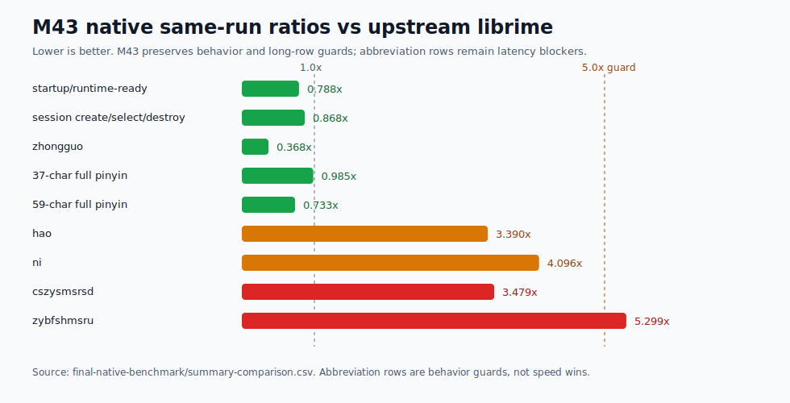
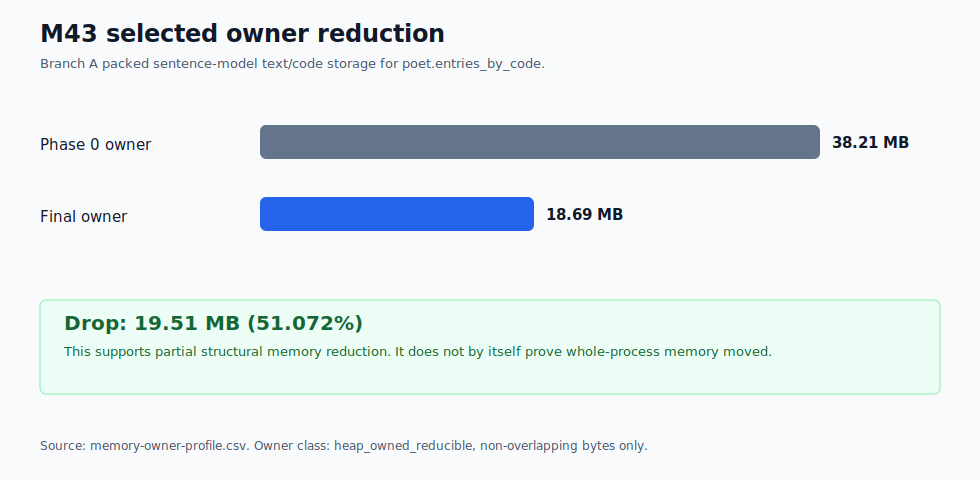
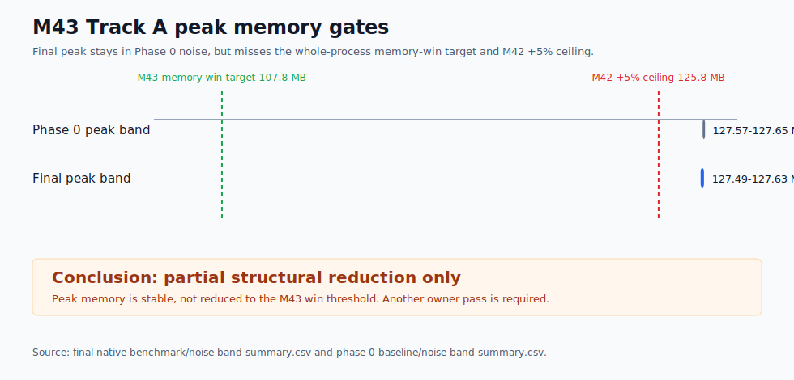
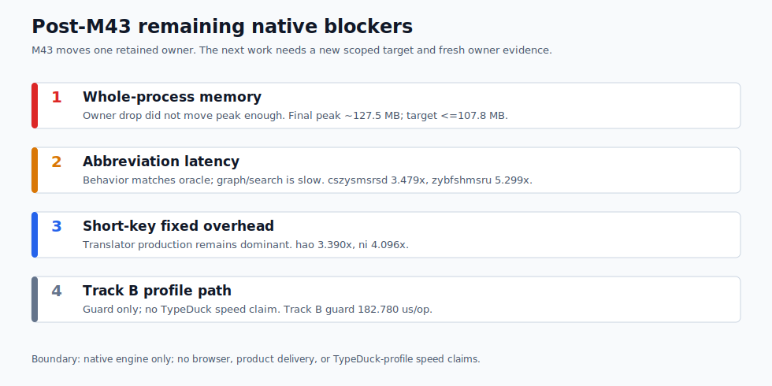

# Yune vs upstream librime performance dashboard

Date: 2026-06-26

This report is native-engine evidence only. It does not claim browser,
frontend, product-delivery, packaging, public-demo, or TypeDuck-profile speed
wins.

Browser startup remains tracked separately. M41 closed the `apps/yune-web`
startup-harness milestone with production-browser evidence under
[`../../apps/yune-web/e2e/results/m41-yune-web-startup-optimization/`](../../apps/yune-web/e2e/results/m41-yune-web-startup-optimization/).

## Current Verdict

M43 closes as a partial structural memory reduction, not as a whole-process
memory win and not as a short-key speed win.

Phase 0 selected the memory-owner branch because Track A `luna_pinyin`
reported one bounded non-overlapping heap-owned reducible owner above the M43
trigger: `poet.entries_by_code` at `38,208,541 B`. The accepted change packs
sentence-model text/code storage behind compact ranges and interned code bytes
while preserving the M40 sentence lookup index and the M42 abbreviation branch.

Final owner movement is material:

- `poet.entries_by_code`: `38,208,541 B` -> `18,694,662 B`
- Drop: `19,513,879 B` (`51.072%`)

The whole process did not move enough to claim a memory win. Final Track A peak
working set stays inside the Phase 0 noise band (`127,492,096-127,627,264 B`
final versus `127,574,016-127,647,744 B` Phase 0), but it is not near the M43
whole-process target of `<=107,797,708 B`. It also remains above the historical
M42 `+5%` memory ceiling, so this report records that as a measured blocker
rather than marking memory parity.

## Visual Dashboard

## Final Native Dashboard

Same-run oracle: upstream `rime/librime 1.17.0` with `luna_pinyin`.

| Row | Yune median | librime median | Ratio / guard | M43 result |
| --- | ---: | ---: | ---: | --- |
| startup/runtime-ready | `23,640.300 us` | `30,007.900 us` | `0.788x` | Pass |
| session create/select/destroy | `24,163.200 us` | `27,837.100 us` | `0.868x` | Pass |
| `hao` | `38.533 us` | `11.367 us` | `3.390x` | Guard pass; not optimized |
| `ni` | `57.350 us` | `14.000 us` | `4.096x` | Guard pass; not optimized |
| `zhongguo` | `61.075 us` | `166.162 us` | `0.368x` | Pass |
| `ceshiyixiachangjushuruxingnengzenyang` | `286.549 us` | `291.022 us` | `0.985x` | Pass |
| `zhegeyinqingqishiyinggaizhichichaochangjuzishurucainengyong` | `489.329 us` | `667.159 us` | `0.733x` | Pass |
| `cszysmsrsd` | `4,193.150 us` | `1,205.380 us` | `3.479x` | Behavior guard pass; latency blocker |
| `zybfshmsru` | `4,467.740 us` | `843.120 us` | `5.299x` | Behavior guard pass; latency blocker |

The M42 abbreviation rows remain behavior guards only. Final native
oracle-vs-Yune candidate output still matches for candidate text, comments,
order, context preedit, commit preview, and first-page metadata.

## Memory And Storage

| Metric | Phase 0 | Final | Result |
| --- | ---: | ---: | --- |
| `poet.entries_by_code` retained bytes | `38,208,541 B` | `18,694,662 B` | Structural owner reduced by `19,513,879 B`. |
| Track A repeated-run peak band | `127,574,016-127,647,744 B` | `127,492,096-127,627,264 B` | Inside Phase 0 noise; no whole-process win. |
| Whole-process memory-win target | n/a | `<=107,797,708 B` required | Not met. |
| Historical M42 `+5%` ceiling | n/a | `125,763,994 B` | Not met; recorded blocker. |
| Track B guard peak | `504,279,040 B` | `504,672,256 B` | Guard-family result; no TypeDuck speed claim. |

Track A final storage/status:

- `selected_storage=rsmarisa_byte_backed`
- table/prism mapping mode: `mmap`
- selected table/prism heap mirror bytes: `0`
- `source_fallback=false`
- `rsmarisa_status=ok`
- `rsmarisa_mapping_mode=mmap`
- positive `rsmarisa` exact/prefix counters remain present in target rows
- first-page output and `RimeGetContext` stay page-bounded

## Short-Key Owner Profile

M43 did not select the short-key branch. Phase 0 and final profiling show that
`hao`/`ni` still spend most of their time in translator production after raw
prism/table lookup:

| Row | Phase 0 translator | Final translator | Final raw table | Final context export | Final ABI string allocation |
| --- | ---: | ---: | ---: | ---: | ---: |
| `hao` | `34.900 us` | `34.500 us` | `13.700 us` | `1.400 us` | `0.133 us` |
| `ni` | `53.650 us` | `53.100 us` | `17.200 us` | `1.400 us` | `0.200 us` |

Because Branch A was selected, these rows are guards. They did not need to meet
the Branch B `15%` improvement targets, and no short-key parity claim is made.

## Evidence Bundle

Primary evidence root:
[`./evidence/m43-native-memory-short-key-owner-reduction/`](./evidence/m43-native-memory-short-key-owner-reduction/)

Key artifacts:

- Phase 0 benchmark, owner profile, noise band, and verdict:
  [`phase-0-baseline/`](./evidence/m43-native-memory-short-key-owner-reduction/phase-0-baseline/)
- Final benchmark bundle:
  [`final-native-benchmark/`](./evidence/m43-native-memory-short-key-owner-reduction/final-native-benchmark/)
- Final row comparison:
  [`summary-comparison.csv`](./evidence/m43-native-memory-short-key-owner-reduction/final-native-benchmark/summary-comparison.csv)
- Final candidate-output comparison:
  [`oracle-vs-yune-candidate-output.md`](./evidence/m43-native-memory-short-key-owner-reduction/final-native-benchmark/oracle-vs-yune-candidate-output.md)
- Final noise summary:
  [`noise-band-summary.md`](./evidence/m43-native-memory-short-key-owner-reduction/final-native-benchmark/noise-band-summary.md)
- M43 visualizations:
  [`visuals/`](./evidence/m43-native-memory-short-key-owner-reduction/visuals/)

## Remaining Gaps Ranked

| Rank | Gap | Evidence | Next diagnostic action |
| ---: | --- | --- | --- |
| 1 | Whole-process memory | M43 reduced `poet.entries_by_code` by `19.5 MB`, but Track A peak stayed around `127.5 MB`. | Run another memory-owner pass; the next owner must move peak, not just structural accounting. |
| 2 | Track A abbreviation sentence latency | `cszysmsrsd` and `zybfshmsru` still run at `3.479x` and `5.299x` same-run librime. | Open a separate abbreviation graph/search milestone if this becomes the next target. |
| 3 | Track A short-key fixed overhead | `hao` and `ni` remain `3.390x` and `4.096x` same-run librime. | Open a Branch B-style short-key milestone only after naming a reducible translator/materialization/export owner. |
| 4 | Track B profile storage and memory | Track B remains guard-only; no TypeDuck-profile speed claim is made. | Use a separate TypeDuck-profile plan if a named product row needs it. |
