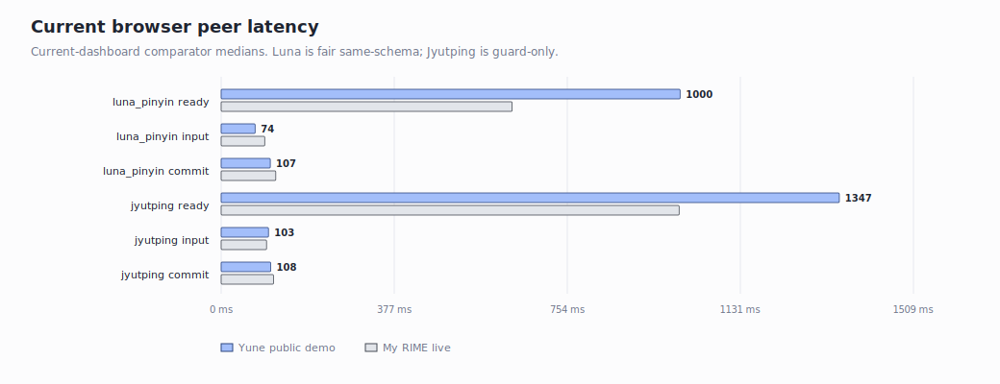
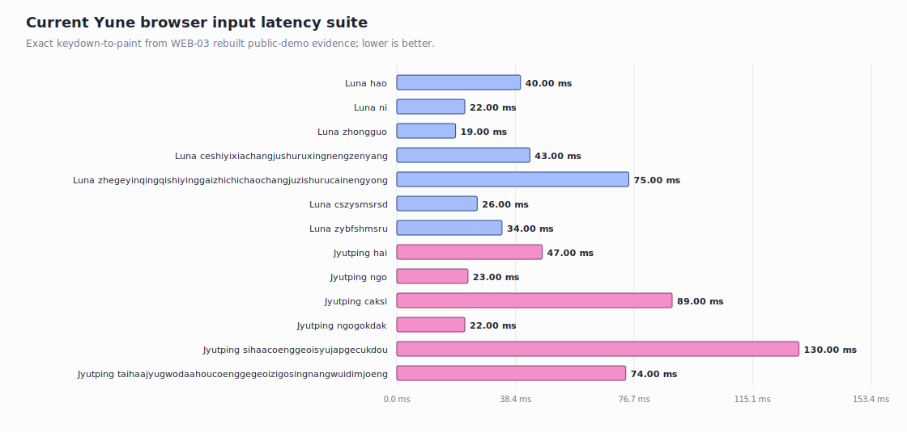

# Current Yune Performance Dashboard

Date: 2026-06-29

This dashboard shows the current benchmark state only. Older milestone closeout
narrative and superseded benchmark rows remain in
[`history/2026-06-28-yune-vs-librime-performance-pre-current-dashboard.md`](./history/2026-06-28-yune-vs-librime-performance-pre-current-dashboard.md).

The native lane was refreshed by the M49 Track A follow-up benchmark on
2026-06-29. The browser lane is carried forward from the 2026-06-28 Playwright
run and was not re-measured in this pass.

## Technical Summary

- **Native fair lane (`luna_pinyin`)**: Yune remains faster than same-run upstream
  librime 1.17.0 on startup (`0.982x`), session create/select (`0.997x`),
  `zhongguo` (`0.282x`), the 59-character row (`2.280x`, under the 3x gate), and
  both abbreviation rows (`0.450x`, `0.663x`). The launch-readiness latency gate
  is still **partial** because `n` is `3.074x`, `ni` is `3.269x`, and the
  37-character row is `3.094x`.
- **Native Track A memory**: current high-water is `188.3 MB` versus librime's
  `17.6 MB` max peer peak in the same run. This is the post-M48 full
  `luna_pinyin` preset-vocabulary shape and is separate from the M47
  `jyut6ping3_mobile` iOS-keyboard profile.
- **Native product path (`jyut6ping3_mobile`, non-peer)**: the heavy benchmark
  harness still shows the M47 owned-heap win. Private bytes on the key-load row
  are `179.0 MB` versus the old `420.0 MB`; peak working set is flat at
  `503.7 MB` because this harness includes deploy/compile transient work.
- **Browser fair lane (`luna_pinyin`, carried 2026-06-28)**: Yune public demo
  uses `64.0 MiB` WASM peak versus My RIME `16.0 MiB` (`4.0x`). Yune is slower
  to ready (`1000 ms` vs `634 ms`), but faster on first input (`74 ms` vs
  `95 ms`).
- **Browser Jyutping (carried 2026-06-28)**: Yune public demo is byte-backed at
  `160.0 MiB` WASM peak. This is a guard row, not a fair peer comparison,
  because My RIME's Jyutping uses a different Cantonese-only dictionary.

## Current Evidence Bundle

The normalized dashboard source is
[`evidence/current-performance-dashboard-2026-06-29/`](./evidence/current-performance-dashboard-2026-06-29/).

Fresh native source:
[`evidence/m49-track-a-short-key-latency/final-native-benchmark/summary.csv`](./evidence/m49-track-a-short-key-latency/final-native-benchmark/summary.csv).

## Native Track A

| Dimension | Yune median | librime median | Yune / librime | Current read |
| --- | ---: | ---: | ---: | --- |
| startup | `22,451.900 us` | `22,865.800 us` | `0.982x` | Yune faster |
| session | `23,116.500 us` | `23,182.400 us` | `0.997x` | Yune faster |
| `n` | `62.400 us` | `20.300 us` | `3.074x` | blocker |
| `ni` | `46.250 us` | `14.150 us` | `3.269x` | blocker |
| `hao` | `26.300 us` | `11.700 us` | `2.248x` | pass |
| `zhongguo` | `47.475 us` | `168.088 us` | `0.282x` | Yune faster |
| 37-char pinyin | `894.400 us` | `289.043 us` | `3.094x` | blocker |
| 59-char pinyin | `1,543.742 us` | `677.066 us` | `2.280x` | pass |
| abbreviation 10-char | `552.300 us` | `1,228.450 us` | `0.450x` | Yune faster |
| abbreviation 8-char | `574.120 us` | `865.690 us` | `0.663x` | Yune faster |

## Native Track B (Product Path, Non-Peer)

The `jyut6ping3_mobile` product path has no fair librime peer in this dashboard.
It is tracked because it is the TypeDuck keyboard target. These figures come from
the heavy in-process benchmark harness, not the lean iOS-proxy
`native_memory_probe`:

| Measurement | 2026-06-28 | 2026-06-29 | Read |
| --- | ---: | ---: | --- |
| Private bytes (key load) | `420.0 MB` | `179.0 MB` | M47 byte-backing collapsed the owned heap |
| Private bytes (session) | `405.8 MB` | `173.9 MB` | steady private bytes down with byte-backed records |
| Median working set (key load) | `440.1 MB` | `252.1 MB` | resident working set down with the owned-heap cut |
| Peak working set high-water | `504.4 MB` | `503.7 MB` | flat; dominated by in-process deploy/compile transient |
| Session create latency | `141,590.4 us` | `93,146.1 us` | faster with byte-backed records |

The lean iOS-dirty proxy for the comments-intact keyboard profile remains in
[`ios-memory-budget.md`](./ios-memory-budget.md): `~22 MB` private. That is the
iOS-budget proxy; the `179.0 MB` row above is the heavy benchmark harness.

## Memory High-Water

| Lane | Yune | Peer | Current read |
| --- | ---: | ---: | --- |
| Native Track A peak working set | `188.3 MB` | librime max peer peak `17.6 MB` | current blocker |
| Browser `luna_pinyin` WASM peak (carried) | `64.0 MiB` | My RIME `16.0 MiB` | fair browser gap is `4.0x` |
| Browser Jyutping WASM peak (carried) | `160.0 MiB` | My RIME `68.0 MiB` | guard only, dictionary-confounded |

## Browser Peer Dashboard

Carried forward from the 2026-06-28 Playwright run.

| Scenario | Schema | Ready | Input -> candidate | Commit | WASM peak | Unique encoded resources | Validity |
| --- | --- | ---: | ---: | ---: | ---: | ---: | --- |
| Yune public demo | `luna_pinyin` | `1000 ms` | `74 ms` | `107 ms` | `64.0 MiB` | `29.5 MiB` | fair |
| My RIME live | `luna_pinyin` | `634 ms` | `95 ms` | `119 ms` | `16.0 MiB` | `8.5 MiB` | fair |
| Yune public demo | Jyutping | `1347 ms` | `103 ms` | `108 ms` | `160.0 MiB` | `72.2 MiB` | guard only |
| My RIME live | Jyutping | `998 ms` | `99 ms` | `114 ms` | `68.0 MiB` | `24.9 MiB` | guard only |

## Yune Browser Input-Latency Suite

Carried forward from the 2026-06-28 run.

| Schema | Input | Exact keydown-to-paint | Max during input | WASM peak |
| --- | --- | ---: | ---: | ---: |
| `luna_pinyin` | `hao` | `40 ms` | `40 ms` | `64.0 MiB` |
| `luna_pinyin` | `ni` | `22 ms` | `22 ms` | `64.0 MiB` |
| `luna_pinyin` | `zhongguo` | `19 ms` | `30 ms` | `64.0 MiB` |
| `luna_pinyin` | `ceshiyixiachangjushuruxingnengzenyang` | `43 ms` | `45 ms` | `64.0 MiB` |
| `luna_pinyin` | `zhegeyinqingqishiyinggaizhichichaochangjuzishurucainengyong` | `75 ms` | `78 ms` | `64.0 MiB` |
| `luna_pinyin` | `cszysmsrsd` | `26 ms` | `29 ms` | `64.0 MiB` |
| `luna_pinyin` | `zybfshmsru` | `34 ms` | `47 ms` | `64.0 MiB` |
| `jyut6ping3_mobile` | `hai` | `47 ms` | `47 ms` | `160.0 MiB` |
| `jyut6ping3_mobile` | `ngo` | `23 ms` | `24 ms` | `160.0 MiB` |
| `jyut6ping3_mobile` | `caksi` | `89 ms` | `90 ms` | `160.0 MiB` |
| `jyut6ping3_mobile` | `ngogokdak` | `22 ms` | `33 ms` | `160.0 MiB` |
| `jyut6ping3_mobile` | `sihaacoenggeoisyujapgecukdou` | `130 ms` | `136 ms` | `160.0 MiB` |
| `jyut6ping3_mobile` | `taihaajyugwodaahoucoenggegeoizigosingnangwuidimjoeng` | `74 ms` | `74 ms` | `160.0 MiB` |

## Remaining Current Gaps

| Rank | Gap | Current value | Next diagnostic target |
| ---: | --- | --- | --- |
| 1 | Native Track A peak memory | `188.3 MB` vs librime max peer peak `17.6 MB` | post-M48 full Luna preset-vocabulary/process residency attribution |
| 2 | Browser `luna_pinyin` memory | `64.0 MiB` vs My RIME `16.0 MiB` | WASM runtime floor and public-demo resource/heap split |
| 3 | Native `ni` latency | `46.250 us` vs `14.150 us` | remaining short-prefix translator/prefix constant factor |
| 4 | Native `n` latency | `62.400 us` vs `20.300 us` | remaining short-prefix translator/prefix constant factor |
| 5 | Native 37-char pinyin latency | `894.400 us` vs `289.043 us` | remaining preset-vocabulary sentence-model graph rebuild cost |
| 6 | Browser `luna_pinyin` startup | `1000 ms` vs My RIME `634 ms` | startup asset/runtime phases after current public-demo build |

## History

Older milestone closeout detail remains in:

- [`history/2026-06-28-yune-vs-librime-performance-pre-current-dashboard.md`](./history/2026-06-28-yune-vs-librime-performance-pre-current-dashboard.md)
- [`plans/completed/`](../plans/completed/)
- [`ledgers/milestone-history.md`](../ledgers/milestone-history.md)
