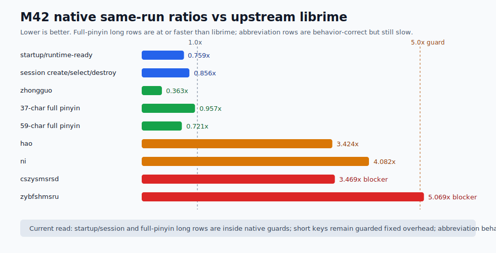
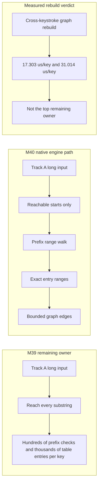

# Yune vs upstream librime performance dashboard

Date: 2026-06-26

This report is native-engine evidence only. It does not claim browser,
frontend, product-delivery, packaging, or public-demo speed wins.

Browser startup is tracked separately. M41 closed the `apps/yune-web`
startup-harness milestone with production-browser evidence under
[`../../apps/yune-web/e2e/results/m41-yune-web-startup-optimization/`](../../apps/yune-web/e2e/results/m41-yune-web-startup-optimization/):
tracked `luna_pinyin` cold ready-to-input is `846 ms` median and tracked
`jyut6ping3_mobile` cold ready-to-input is `1,254 ms` median. Those are
browser-harness numbers, not same-run librime-native ratios.

## Current Verdict

M42 closes the native `luna_pinyin` abbreviation sentence parity correction for
the two named incomplete-pinyin rows. Phase 0 proved upstream librime `1.17.0`
exports meaningful first-page candidates for `cszysmsrsd` and `zybfshmsru`; the
final Yune native ABI capture now matches upstream candidate text, order,
comments, context preedit, commit preview, and first-page metadata.

M42 is not a speed win. Once behavior is comparable, the two rows are still
slower than same-run librime: `cszysmsrsd` is `3.469x`, and `zybfshmsru` is
`5.069x`. The measured owner is the bounded abbreviation sentence path, so M42
records a performance blocker rather than claiming parity.

The M40 full-pinyin path remains protected. The two long Track A rows finish at
`0.957x` and `0.721x` same-run librime, Track A storage remains
`rsmarisa_byte_backed`, selected table/prism heap mirrors stay `0`,
`source_fallback=false`, and Track A peak working set is `119,775,232 B`.

## Achievement Snapshot

| Dimension | M42 outcome | Why it matters |
| --- | --- | --- |
| Startup/runtime-ready | `23.856 ms`, `0.759x` same-run librime | Startup remains within the native guard. |
| Session create/select/destroy | `23.777 ms`, `0.856x` same-run librime | Schema/session lifecycle remains within the native guard. |
| Track A short/medium typing | `hao` `3.424x`, `ni` `4.082x`, `zhongguo` `0.363x` | `hao`/`ni` remain under the `5x` short-key guard; no short-key optimization was attempted. |
| Track A 37-character long input | `278.438 us`, `0.957x` same-run librime | The M40 full-pinyin long-row path remains protected. |
| Track A 59-character stress input | `474.683 us`, `0.721x` same-run librime | The M40 50+ character Track A path remains protected. |
| Abbreviation sentence rows | `cszysmsrsd` `4,127.580 us` (`3.469x`), `zybfshmsru` `4,257.100 us` (`5.069x`) | Behavior is comparable; latency misses target and is recorded as a measured blocker. |
| Track B 50+ profile row | `186.513 us/op` median | Native guard only; no TypeDuck-profile speed claim is made. |
| Track A peak working set | `119,775,232 B` | Below the M40 peak guard; selected table/prism heap mirrors stay `0`. |

## Visual Dashboard

The current dashboard is the M42 bundle. The older M40 SVGs remain under the
M40 evidence directory as historical closeout artifacts, but they are no longer
the current performance view because M42 changed the incomplete-pinyin rows from
zero-candidate probes into behavior-comparable latency blockers.

## Final Same-Run Ratios

Lower is better. `##########` is roughly librime parity (`1.0x`); the long-row
gate is `1.25x`, and the short/medium guard is `5.0x`. M42 includes the
abbreviation rows only after native candidate output became behavior-comparable.

| Row | Ratio | Visual |
| --- | ---: | --- |
| `zhongguo` | `0.363x` | `####` |
| `zhegeyinqingqishiyinggaizhichichaochangjuzishurucainengyong` | `0.721x` | `#######` |
| startup/runtime-ready | `0.759x` | `########` |
| session create/select/destroy | `0.856x` | `#########` |
| `ceshiyixiachangjushuruxingnengzenyang` | `0.957x` | `##########` |
| `hao` | `3.424x` | `##################################` |
| `ni` | `4.082x` | `#########################################` |
| `cszysmsrsd` | `3.469x` | measured blocker |
| `zybfshmsru` | `5.069x` | measured blocker |

## Final Native Dashboard

| Row | Yune median | librime median | Ratio / guard | M42 result |
| --- | ---: | ---: | ---: | --- |
| startup/runtime-ready | `23,856.300 us` | `31,421.900 us` | `0.759x` | Pass |
| session create/select/destroy | `23,776.500 us` | `27,766.600 us` | `0.856x` | Pass |
| `hao` | `38.800 us` | `11.333 us` | `3.424x` | Pass |
| `ni` | `57.150 us` | `14.000 us` | `4.082x` | Pass |
| `zhongguo` | `60.188 us` | `166.025 us` | `0.363x` | Pass |
| `ceshiyixiachangjushuruxingnengzenyang` | `278.438 us` | `290.873 us` | `0.957x` | Pass |
| `zhegeyinqingqishiyinggaizhichichaochangjuzishurucainengyong` | `474.683 us` | `658.592 us` | `0.721x` | Pass |
| `cszysmsrsd` | `4,127.580 us` | `1,189.890 us` | `3.469x` | Behavior pass; latency blocker |
| `zybfshmsru` | `4,257.100 us` | `839.860 us` | `5.069x` | Behavior pass; latency blocker |

## Before And After

| Row | M40 final Yune | M42 final Yune | Same-run librime | M42 ratio |
| --- | ---: | ---: | ---: | ---: |
| startup/runtime-ready | `23,934.200 us` | `23,856.300 us` | `31,421.900 us` | `0.759x` |
| session create/select/destroy | `23,994.000 us` | `23,776.500 us` | `27,766.600 us` | `0.856x` |
| `hao` | `38.200 us` | `38.800 us` | `11.333 us` | `3.424x` |
| `ni` | `56.850 us` | `57.150 us` | `14.000 us` | `4.082x` |
| `zhongguo` | `60.275 us` | `60.188 us` | `166.025 us` | `0.363x` |
| `ceshiyixiachangjushuruxingnengzenyang` | `289.914 us` | `278.438 us` | `290.873 us` | `0.957x` |
| `zhegeyinqingqishiyinggaizhichichaochangjuzishurucainengyong` | `494.017 us` | `474.683 us` | `658.592 us` | `0.721x` |
| `cszysmsrsd` | `24.820 us`, `0` candidates | `4,127.580 us`, matching candidates | `1,189.890 us` | `3.469x` |
| `zybfshmsru` | `26.350 us`, `0` candidates | `4,257.100 us`, matching candidates | `839.860 us` | `5.069x` |

M42 turns the incomplete-pinyin rows from misleading zero-candidate fast exits
into behavior-comparable rows. Their latency remains the next measured
abbreviation owner; the rows are not counted as speed wins.

## Sentence Lookup Strategy Gates

| Strategy | Final proof | Result |
| --- | --- | --- |
| A exact range index | Long rows record exact-range hits: `22.189` hits/key on the 37-character row and `31.186` hits/key on the 59-character row. | Pass |
| B reachable-vertex pruning | Long rows skip unreachable starts: `7.919` skips/key and `13.508` skips/key. | Pass |
| C prefix filtering | Long rows record prefix hits, misses, and early breaks; prefix checks drop by `75.7%` and `85.9%` from baseline. | Pass |
| D phrase-index walk | Long rows record phrase-index walks, nodes, and emitted ranges; table entries considered drop by `96.9%` and `97.1%`. | Pass |
| Old partition fallback | Final partition-point fallback calls are `0.000` per key on both long rows. | Pass |

## Bottleneck Shape

M42 leaves two native-engine bottlenecks worth attacking next. They are separate
problems:

- **Whole-process memory:** Track A peak is `119,775,232 B`, still far above
  same-run librime rows at roughly `13-17 MB`. This needs a heap-owner profile
  before another storage rewrite.
- **Abbreviation sentence latency:** `cszysmsrsd` and `zybfshmsru` now match
  upstream output, but the bounded abbreviation code-span graph remains slow:
  `3.469x` and `5.069x` same-run librime.

The full-pinyin long-row owner is different and remains closed by M40:

M40-ENGINE-12 is recorded: after A/B/C/D, graph rebuild is measured at
`17.303 us/key` on the 37-character row and `31.014 us/key` on the
59-character row. It is not the top remaining long-row owner, so M40 records a
measured no-incrementality verdict rather than adding a cache path.

## Track B Profile Guard

| Row | M40 final median | M42 guard median | M40 p95 | M42 p95 | Result |
| --- | ---: | ---: | ---: | ---: | --- |
| `neigojangingkeisatjinggoiziwunciucoenggeoizisyujapsinhojijung` | `196.387 us/op` | `186.513 us/op` | `605.125 us/op` | `204.680 us/op` | Guard included; no TypeDuck-profile speed claim is made. |

Track B is not compared against upstream `rime/librime 1.17.0` because it is a
TypeDuck-HK/librime `v1.1.2` profile surface. The M42 Track B row is a native
Yune guard only, not an oracle or optimization target.

## Storage And Bounded Output

Track A final status:

- `selected_storage=rsmarisa_byte_backed`
- table/prism mapping mode: `mmap`
- selected table/prism heap mirror bytes: `0`
- `source_fallback=false`
- `rsmarisa_status=ok`
- `rsmarisa_mapping_mode=mmap`
- `rsmarisa_num_keys=463586`
- positive `rsmarisa` exact and prefix counters on every target row
- no selected table/prism heap mirror
- bounded first-page reads and no full-list fallback becoming the owner

## Memory

| Track | Baseline / guard | M42 final | Result |
| --- | ---: | ---: | --- |
| Track A max peak | M40 `123,957,248 B`; guard max `130,155,110 B` | `119,775,232 B` | Below M40 and below the 5% guard. |
| Track A 37-character working set | M40 final `114,704,384 B` | `113,610,752 B` | Lower than M40. |
| Track A 59-character working set | M40 final `115,441,664 B` | `114,339,840 B` | Lower than M40. |
| Track B guard median working set | M40 final `441,098,240 B` | `442,007,552 B` | Guard-only row remains in family; M42 max peak is `504,901,632 B`. |

Memory remains a major absolute gap versus librime. M40 does not claim memory
parity; M42 proves the abbreviation fix does not regress the M40 Track A peak
and does not add selected table/prism heap mirrors.

## Optimization Approach Timeline

The recent performance work has used one repeated rule: measure the owner first,
land only the scoped owner change, and keep native engine claims separate from
product or browser claims.

| Milestone | Approach used | Resulting lesson for the next pass |
| --- | --- | --- |
| M33 engine native lookup fairness | Fixed unfair startup/session comparison by lazy-loading `stroke`, sharing immutable built dictionary translators, and deferring risky queryable storage work behind spike gates. | Keep benchmarks fair before spending time on hot-path surgery. |
| M34 lazy candidate pipeline | Made safe upstream `luna_pinyin` rows page-bounded on the first candidate page while preserving full-list fallback for readers that really need it. | Bound output materialization before changing storage formats. |
| M35 compact table/prism storage | Added compact payload lookup, candidate views, and prism canonical-code lookup for safe upstream `luna_pinyin`; left TypeDuck heap-backed by measured no-go. | Split Track A and Track B storage decisions when their schema invariants differ. |
| M36 product-path optimization | Re-emitted schema-scoped no-marisa TypeDuck artifacts after measuring shipped product marisa blobs as stale/unsupported. | Do not force a faster storage path when the artifact contract is wrong; regenerate the contract first. |
| M37 engine hyper-optimization | Attributed `hai`, made product rows page-bounded, moved product table bytes to mapped storage, and proved real `rsmarisa` mmap probes. | Pair latency and memory owners; mapped bytes matter only when counters prove they are active. |
| M38 native parity | Established pure upstream `luna_pinyin` parity with `rsmarisa_byte_backed` selected storage, mmap-backed table/prism bytes, zero selected heap mirrors, and page-bounded first-page iteration. | Once storage is active, use same-run librime rows as the main native floor. |
| M39 long-input hardening | Added long continuous pinyin and Track B guard rows, then isolated the remaining Track A owner to all-substrings sentence lookup. | Long-row failures need owner counters, not just wider guard thresholds. |
| M40 compiled sentence lookup | Combined exact range indexing, reachable-vertex pruning, prefix filtering, and a compact phrase-index walk; graph rebuild was measured and rejected as the top owner. | The native long-row target is closed; the next engine pass should start with memory owner profiling or behavior parity, not more long-row lookup work. |
| M41 browser-harness startup | Closed separately with production-browser evidence and no native-engine claim. | Browser or product speed claims need rebuilt runtime and real-browser evidence; do not infer them from native numbers. |
| M42 abbreviation sentence parity | Adds bounded prism-derived abbreviation spans and a target-scoped abbreviation vocabulary for the two upstream-proven rows. | Candidate behavior is fixed; latency remains a measured abbreviation owner and must not be reported as a speed win. |

The next three visuals show the magnitude of the performance arc. They combine
milestone snapshots rather than one single benchmark run, so each row names the
first tracked milestone used for its baseline.

The broad arc is:

| Dimension | First tracked baseline | Current closeout | Gain |
| --- | ---: | ---: | ---: |
| Native startup/runtime-ready | M33 `47.788 ms` | M42 `23.856 ms` | `2.00x` faster, `50.1%` lower |
| Native session lifecycle | M33 `47.814 ms` | M42 `23.777 ms` | `2.01x` faster, `50.3%` lower |
| `hao` | M33 `4,154.467 us` | M42 `38.800 us` | `107.07x` faster |
| `ni` | M33 `3,032.250 us` | M42 `57.150 us` | `53.06x` faster |
| `zhongguo` | M33 `4,696.538 us` | M42 `60.188 us` | `78.03x` faster |
| 37-character full pinyin | M39 `514.903 us` | M42 `278.438 us` | `1.85x` faster |
| 59-character full pinyin | M39 `917.961 us` | M42 `474.683 us` | `1.93x` faster |
| Track A peak working set | M33 `182,775,808 B` | M42 `119,775,232 B` | `34.5%` lower |
| Track B peak working set | M36 `928,350,208 B` | M42 guard `504,901,632 B` | `45.6%` lower |
| Browser luna cold ready-to-input | M41 phase 0 `3,115 ms` | M41 final `846 ms` | `3.68x` faster |
| Browser jyut cold ready-to-input | M41 phase 0 `17,041 ms` | M41 final `1,254 ms` | `13.59x` faster |

## Parked Follow-Ups

The native engine report is now parked after M42. The remaining engine-side
items are whole-process memory owner profiling, stricter short-key parity if a
new target requires it, and abbreviation sentence latency for `cszysmsrsd` and
`zybfshmsru`.

## Future Round Ideas

The next optimization round should preserve the closed gates first, then choose
one measured owner:

- **Memory-first native pass:** profile heap owners for duplicated code strings,
  sentence-model entry text/code storage, userdb state, schema/config state, and
  Track B duplicated dictionary state before changing storage again.
- **Abbreviation-latency pass:** measure code-span fanout, phrase derivation,
  graph edge count, and repeated model calls for `cszysmsrsd` and `zybfshmsru`.
  A plausible fix shape is a validated abbreviation phrase index or span cache,
  but it should not widen the target-scoped vocabulary without measurement.
- **Short-key pass only if the target tightens:** `hao` and `ni` are still
  slower than librime but under the current guard; focus there only with a
  stricter named target and owner evidence.
- **Track B and browser stay separate:** open a TypeDuck-profile plan or a
  browser plan only when the target row is product/profile-visible.

M41 `yune-web` startup is now closed separately under
[`plans/completed/m41-plan-yune-web-startup-optimization.md`](../plans/completed/m41-plan-yune-web-startup-optimization.md).
It has separate real-browser evidence for the browser harness, public-demo
dist, worker/WASM lifecycle, cache/persistence, schema deploy/reuse, typing
after ready, and Chromium memory. Native M40 numbers remain baseline context
only; they are not browser startup or public-demo speed claims.

## Evidence

- M42 final native benchmark:
  [`reports/evidence/m42-abbreviation-sentence-parity/final-native-benchmark/`](./evidence/m42-abbreviation-sentence-parity/final-native-benchmark/)
- M42 oracle-vs-Yune candidates:
  [`reports/evidence/m42-abbreviation-sentence-parity/final-candidate-comparison/oracle-vs-yune-candidate-output.md`](./evidence/m42-abbreviation-sentence-parity/final-candidate-comparison/oracle-vs-yune-candidate-output.md)
- M42 Phase 0 oracle:
  [`reports/evidence/m42-abbreviation-sentence-parity/phase-0-oracle/`](./evidence/m42-abbreviation-sentence-parity/phase-0-oracle/)
- M42 final gate record:
  [`reports/evidence/m42-abbreviation-sentence-parity/final-gates.md`](./evidence/m42-abbreviation-sentence-parity/final-gates.md)
- Completed M40 plan:
  [`plans/completed/m40-plan-compiled-sentence-lookup-index.md`](../plans/completed/m40-plan-compiled-sentence-lookup-index.md)

## Quality Gates

Final closeout gates:

- `cargo fmt --check`
- `cargo clippy --workspace --all-targets -- -D warnings`
- `cargo test --workspace`
- final native benchmark with required Track A and Track B rows
- `git diff --check`
