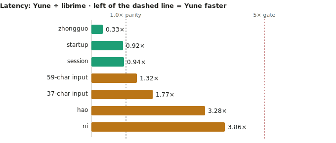
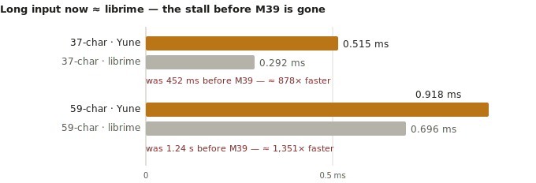
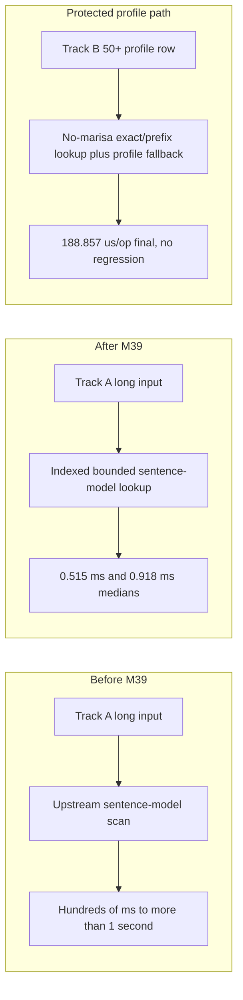
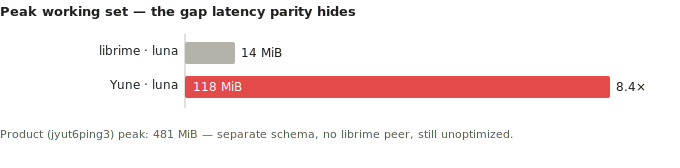

# Yune vs upstream librime performance dashboard

Date: 2026-06-25

This report is native-engine evidence only. It does not claim browser,
frontend, product-delivery, packaging, or public-demo speed wins.

## Current Verdict

M39 closes the post-M38 long-input engine-hardening gap for the named target
set. Startup/session and the short/medium rows remain inside their existing
gates, both Track A upstream `luna_pinyin` long rows are inside the `5x`
same-run native gate, and the Track B `jyut6ping3_mobile` 50+ character profile
row is measured, attributed, and no-regressed.

The Track A and Track B long rows do not share the same owner. Track A was
dominated by upstream sentence-model scanning and now uses indexed, bounded
sentence-model lookup. Track B remains a TypeDuck profile path dominated by
no-marisa exact/prefix lookup plus profile fallback/full-list merge semantics.
That path is preserved and gated rather than optimized by the Track A change.

## Achievement Snapshot

| Dimension | M39 outcome | Why it matters |
| --- | --- | --- |
| Startup/runtime-ready | `25.048 ms`, `0.917x` same-run librime | Engine startup remains at librime level after the long-input changes. |
| Session create/select/destroy | `25.256 ms`, `0.938x` same-run librime | Schema/session lifecycle remains at librime level. |
| Track A short/medium typing | `hao` `3.281x`, `ni` `3.863x`, `zhongguo` `0.329x` | Short rows stayed inside the established gate while long rows were fixed. |
| Track A 37-character long input | `452.200 ms` -> `0.515 ms`, about `878x` faster | The original long-input stall is removed. |
| Track A 59-character stress input | `1,240.081 ms` -> `0.918 ms`, about `1,351x` faster | 50+ character sentence input is now comfortably under the `5x` native gate. |
| Track B 50+ profile row | `189.207 us/op` -> `188.857 us/op` | The protected profile path did not regress. |
| Track A peak working set | `156.0 MiB` -> `118.2 MiB`, about `24%` lower | The sentence-model fix also removed a transient memory owner. |

## Visual Summary

### Final Same-Run Ratios

Lower is better. `##########` is roughly librime parity (`1.0x`); the M39
native gate for comparison rows is `5.0x`.

| Row | Ratio | Visual |
| --- | ---: | --- |
| startup/runtime-ready | `0.917x` | `#########` |
| session create/select/destroy | `0.938x` | `#########` |
| `zhongguo` | `0.329x` | `###` |
| `zhegeyinqingqishiyinggaizhichichaochangjuzishurucainengyong` | `1.320x` | `#############` |
| `ceshiyixiachangjushuruxingnengzenyang` | `1.765x` | `##################` |
| `hao` | `3.281x` | `#################################` |
| `ni` | `3.863x` | `#######################################` |

### Long-Input Collapse

M39 removed the long-input stall while keeping the final rows close to
librime.

| Row | Phase 0 Yune | M39 final Yune | Same-run librime | Yune improvement |
| --- | ---: | ---: | ---: | ---: |
| 37-character Track A row | `452.200 ms` | `0.515 ms` | `0.292 ms` | `878x` |
| 59-character Track A row | `1,240.081 ms` | `0.918 ms` | `0.696 ms` | `1,351x` |

A linear axis would render the M39 rows as invisible slivers next to the
pre-M39 bars, so this view shows the final near-parity state with the pre-M39
stall annotated. Exact before/after values are in the table above.

### Bottleneck Shape

## Evidence

- M39 final gates:
  [`reports/evidence/m39-long-input-engine-hardening/final-gates.md`](./evidence/m39-long-input-engine-hardening/final-gates.md)
- Final native benchmark:
  [`reports/evidence/m39-long-input-engine-hardening/phase-4-final-native/`](./evidence/m39-long-input-engine-hardening/phase-4-final-native/)
- Baseline:
  [`reports/evidence/m39-long-input-engine-hardening/phase-0-baseline/`](./evidence/m39-long-input-engine-hardening/phase-0-baseline/)
- Owner attribution:
  [`reports/evidence/m39-long-input-engine-hardening/phase-1-attribution/owner-attribution.md`](./evidence/m39-long-input-engine-hardening/phase-1-attribution/owner-attribution.md)
- Memory attribution:
  [`reports/evidence/m39-long-input-engine-hardening/phase-3-memory/memory-owner-summary.md`](./evidence/m39-long-input-engine-hardening/phase-3-memory/memory-owner-summary.md)
- Completed plan:
  [`plans/completed/m39-plan-long-input-engine-hardening.md`](../plans/completed/m39-plan-long-input-engine-hardening.md)

## Final Native Dashboard

| Row | Yune median | librime median | Ratio | M39 result |
| --- | ---: | ---: | ---: | --- |
| startup/runtime-ready | `25,048.200 us` | `27,314.000 us` | `0.917x` | Pass |
| session create/select/destroy | `25,255.500 us` | `26,938.500 us` | `0.938x` | Pass |
| `hao` | `38.933 us` | `11.867 us` | `3.281x` | Pass |
| `ni` | `56.200 us` | `14.550 us` | `3.863x` | Pass |
| `zhongguo` | `60.588 us` | `183.887 us` | `0.329x` | Pass |
| `ceshiyixiachangjushuruxingnengzenyang` | `514.903 us` | `291.786 us` | `1.765x` | Pass |
| `zhegeyinqingqishiyinggaizhichichaochangjuzishurucainengyong` | `917.961 us` | `695.653 us` | `1.320x` | Pass |

## Before And After

| Row | Phase 0 Yune | Final Yune | Final librime | Final ratio |
| --- | ---: | ---: | ---: | ---: |
| startup/runtime-ready | `25,117.100 us` | `25,048.200 us` | `27,314.000 us` | `0.917x` |
| session create/select/destroy | `24,309.000 us` | `25,255.500 us` | `26,938.500 us` | `0.938x` |
| `hao` | `38.167 us` | `38.933 us` | `11.867 us` | `3.281x` |
| `ni` | `56.500 us` | `56.200 us` | `14.550 us` | `3.863x` |
| `zhongguo` | `61.700 us` | `60.588 us` | `183.887 us` | `0.329x` |
| `ceshiyixiachangjushuruxingnengzenyang` | `452,200.116 us` | `514.903 us` | `291.786 us` | `1.765x` |
| `zhegeyinqingqishiyinggaizhichichaochangjuzishurucainengyong` | `1,240,080.937 us` | `917.961 us` | `695.653 us` | `1.320x` |

## Track B Profile Gate

| Row | Phase 0 median | Final median | Phase 0 p95 | Final p95 | Result |
| --- | ---: | ---: | ---: | ---: | --- |
| `neigojangingkeisatjinggoiziwunciucoenggeoizisyujapsinhojijung` | `189.207 us/op` | `188.857 us/op` | `202.084 us/op` | `194.910 us/op` | Pass |

Track B is not compared against upstream `rime/librime 1.17.0` because it is a
TypeDuck-HK/librime `v1.1.2` profile surface. The M39 gate is native Yune
profile no-regression plus owner attribution.

## Storage And Bounded Output

Track A final status:

- `selected_storage=rsmarisa_byte_backed`
- table/prism mapping mode: `mmap`
- selected table/prism heap mirror bytes: `0`
- `source_fallback=false`
- `rsmarisa_status=ok`
- `rsmarisa_mapping_mode=mmap`
- `rsmarisa_num_keys=463586`
- positive `rsmarisa` exact and prefix counters on target rows
- no ordinary no-marisa fallback on Track A target rows
- bounded first-page reads and no full-list fallback on target rows

Track B final status:

- `selected_storage=byte_backed`
- table/prism mapping mode: `mmap`
- selected table/prism heap mirror bytes: `0`
- `source_fallback=false`
- `rsmarisa_status=missing_string_table`
- bounded request counted, with profile fallback/full-list merge counted and
  explained for compatibility

## Memory

| Track | Phase 0 | Final | Result |
| --- | ---: | ---: | --- |
| Track A max peak | `163,598,336 B` | `123,985,920 B` | Lower after streaming sentence-model construction. |
| Track A 37-character working set | `114,974,720 B` | `111,755,264 B` | Lower. |
| Track A 59-character working set | `116,555,776 B` | `112,635,904 B` | Lower. |
| Track B long-row working set | `441,483,264 B` | `441,450,496 B` | Flat to slightly lower. |
| Track B peak | `504,557,568 B` | `504,041,472 B` | Lower. |

Memory is the one dimension still far from librime: latency reached parity, but
Yune's whole-process working set remains about `8.4x` librime on the fair Track
A comparison, and the TypeDuck product peak is `~481 MiB`. This is the main open
gap and the natural next target after a heap-owner profile.

The M39-owned memory owner was transient upstream sentence-model construction:
the old build path held a full temporary table-entry list alongside model
entries. `UpstreamSentenceModel::from_table_entries` now streams entries into
the model, reducing the Track A peak without adding selected table/prism heap
mirrors.

## Quality Gates

Final closeout gates passed:

- `cargo fmt --check`
- `cargo clippy --workspace --all-targets -- -D warnings`
- `cargo test --workspace`
- `cargo test -p yune-core translator:: -- --nocapture`
- `cargo test -p yune-core upstream_luna_pinyin -- --nocapture`
- `cargo test -p yune-rime-api --test typeduck_windows_boundary -- --nocapture`
- final native benchmark with `-TrackBInputs`
- `git diff --check`
