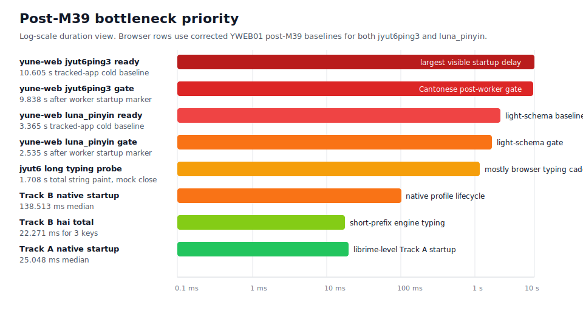
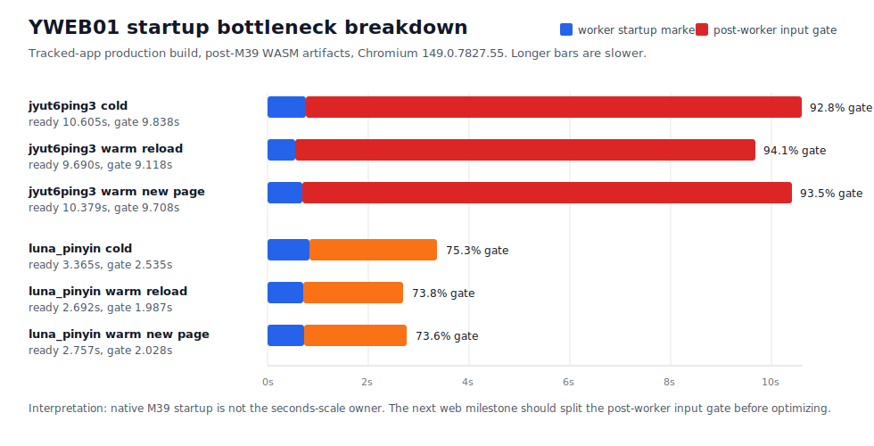

# Yune vs upstream librime root-cause dashboard

Date: 2026-06-26

This report explains M39 native-engine behavior and the follow-up YWEB01 browser
diagnostic baseline separately. It does not claim browser, frontend,
product-delivery, packaging, or public-demo speed wins.

## Current Verdict

The M39 long-input failure was not a lookup-storage failure. Track A already
used the deployed `luna_pinyin` `rsmarisa` string table through mmap-backed
selected bytes. The dominant owner was upstream sentence-model composition:
each long uninterrupted pinyin row drove expensive code-prefix and vocabulary
scans before the first page was needed.

M39 fixed that owner by indexing `UpstreamSentenceModel` by code, reusing a
bounded dynamic-programming pass across end positions, and routing first-page
native requests through a limited sentence-model path. It also streamed table
entries into the sentence model at build time so the M39-owned transient memory
peak no longer holds a full temporary table-entry list beside the model.

Track B was different. The required
`neigojangingkeisatjinggoiziwunciucoenggeoizisyujapsinhojijung` row did not use
the upstream sentence model. It stayed on a TypeDuck profile path with
no-marisa exact/prefix lookup and profile fallback/full-list merge behavior.
M39 preserved and gated that path instead of applying the Track A rewrite to it.

The post-M39 priority call is therefore different from the pre-M39 one:

- If the target is **user-perceived startup speed**, optimize the web harness
  next. The YWEB01 post-M39 browser baseline now has both the light
  `luna_pinyin` row and the Cantonese `jyut6ping3` row on commit `926098a4`.
  Tracked-app `luna_pinyin` cold ready-to-input is `3.365 s`, while
  tracked-app `jyut6ping3` cold ready-to-input is `10.605 s`. The
  `jyut6ping3` unsplit input gate after the worker startup marker is `9.838 s`.
  That is still far larger than native engine startup/session rows.
- If the target is **native engine parity**, the next engine work should not be
  another broad long-input pass. It should target one of two named gaps:
  whole-process memory, which still needs a real heap-owner profile, or the
  Track B `hai` short-prefix enumeration path, which is already
  counter-attributed.

## Post-M39 Priority Map

The web numbers in this visualization are YWEB01 post-M39 evidence from the
separate startup-benchmark worktree. Both runs used rebuilt post-M39 WASM
artifacts and browser `149.0.7827.55`. The light-schema `luna_pinyin` baseline
is still seconds-scale: cold `3.365 s`, warm reload `2.692 s`, and warm new page
`2.757 s`. The Cantonese `jyut6ping3` baseline is much slower: cold `10.605 s`,
warm reload `9.690 s`, and warm new page `10.379 s`.

## Browser Harness Bottleneck Analysis

The measured browser startup bottleneck is not the native engine's startup row.
It is the **post-worker input gate**: the time after the worker emits the
`startup:complete` marker but before the UI input becomes enabled.

| Schema row | Ready median | Worker startup marker | Post-worker input gate | Gate share |
| --- | ---: | ---: | ---: | ---: |
| `jyut6ping3` cold first load | `10.605 s` | `760 ms` | `9.838 s` | `92.8%` |
| `jyut6ping3` warm reload | `9.690 s` | `552 ms` | `9.118 s` | `94.1%` |
| `jyut6ping3` warm new page | `10.379 s` | `685 ms` | `9.708 s` | `93.5%` |
| `luna_pinyin` cold first load | `3.365 s` | `825 ms` | `2.535 s` | `75.3%` |
| `luna_pinyin` warm reload | `2.692 s` | `708 ms` | `1.987 s` | `73.8%` |
| `luna_pinyin` warm new page | `2.757 s` | `720 ms` | `2.028 s` | `73.6%` |

The `luna_pinyin` row is still useful, but only as a light-schema control. The
product-representative Cantonese row adds about `7.2 s` on cold load
(`10.605 s - 3.365 s`) and remains near `10 s` on warm rows. That means the next
web milestone should not close on the `luna_pinyin` row alone.

The current attribution confidence is uneven:

| Owner | Confidence | Why |
| --- | --- | --- |
| Post-worker input gate owns startup pain | High | It is directly measured and owns `73.6-94.1%` of tracked-app ready time. |
| Cantonese schema path adds most of the web startup pain | High | Same harness and artifacts: `jyut6ping3` cold is `10.605 s`; `luna_pinyin` cold is `3.365 s`. |
| Exact owner inside the gate | Low | The gate is intentionally unsplit. It may include worker message sequencing, schema/deploy work after marker emission, cache or persistence work, option application, userdb refresh, React state, and paint. |
| Public-demo product startup | Blocked | Real-worker public-demo still fails with `Cache.put: Entry already exists`, so tracked-app production is the only usable Cantonese browser baseline. |

Typing probes point at a separate bottleneck. For `jyut6ping3`, the long probe
`taihaajyugwodaahoucoenggegeoizigosingnangwuidimjoeng` lands at
`1.591-1.708 s` on real-worker rows, but mock-worker rows are also about
`1.62 s`. Worker-process medians for the same probe are only `7-10 ms` on the
tracked real-worker rows. The total string timing is therefore dominated by
scripted key cadence, React paint observation, and browser messaging rather than
native lookup compute.

Next diagnostic priorities:

1. Fix the public-demo `Cache.put: Entry already exists` blocker so the shipped
   build can produce a real product startup row.
2. Split the post-worker input gate into worker message, schema/deploy,
   cache/persistence, option/userdb, React state, and paint spans.
3. Keep `jyut6ping3` as the web startup gate and `luna_pinyin` as the light
   control row.
4. Treat typing responsiveness separately from startup; use last-key-to-paint
   and worker-process metrics rather than total typed-string time alone.

## Native Bottleneck Map

| Area | M39 finding | Final status |
| --- | --- | --- |
| Track A 37-character row | Dominated by `upstream_sentence_model_ns` at `436,917.530 us/op` before implementation. | Final Yune `514.903 us`, librime `291.786 us`, ratio `1.765x`. |
| Track A 59-character row | Dominated by `upstream_sentence_model_ns` at `1,228,565.656 us/op` before implementation. | Final Yune `917.961 us`, librime `695.653 us`, ratio `1.320x`. |
| Track B 50+ Cantonese row | Separate profile owner: no upstream sentence model; no-marisa exact/prefix lookup plus profile fallback. | Final median `188.857 us/op`, about `11.5 ms` total for 61 keys, p95 `194.910 us/op`, below Phase 0. |
| Track B `hai` short-prefix row | Actual remaining typing outlier: translator is about `99.9%` of process-key time and visits `19,918` lookup views for 3 keys. | Final median `7,425.800 us/op`, about `22.3 ms` total and `6,639` lookup views/key. |
| Storage | Track A hot path already used `rsmarisa_byte_backed` selected storage. | Preserved: table/prism `mmap`, selected heap mirrors `0`, positive `rsmarisa` counters. |
| Bounded output | Long Track A rows needed first-page bounded sentence output, not full-list materialization. | Preserved: Track A target rows show bounded requests and no full-list fallback. |
| Memory | M39-owned transient sentence-model build held duplicate table/model data. | Reduced: Track A max peak `163,598,336 B` -> `123,985,920 B`. |

## Remaining Gaps Ranked

| Rank | Gap | Evidence | Next diagnostic action |
| ---: | --- | --- | --- |
| 1 | Whole-process memory | Track A peak is `118.2 MiB`; same-run librime Track A peaks are roughly `13-17 MiB` depending row. Track B product peak is `480.7 MiB`. | Run a real heap-owner profile before optimizing. M39 proved selected table/prism heap mirrors are `0`, so guessing at table storage again is unlikely to be enough. |
| 2 | Track B `hai` short ambiguous prefix | `22.3 ms` total for 3 keys; `19,918` lookup views/sample; bounded output owns only `52` candidates/sample, so the cost is enumeration before the page is chosen. | Split no-marisa compact exact lookup, prefix lookup, prefix fallback, and profile full-list merge more finely; then make the broad-prefix enumeration page-aware or index-backed. |
| 3 | Web `jyut6ping3` readiness/input gate | Post-M39 YWEB01 cold ready `10.605 s`, warm reload `9.690 s`, warm new page `10.379 s`; the largest owner is the unsplit post-worker input gate at `9.118-9.838 s`. The `luna_pinyin` control row is `3.365 s` cold, so the Cantonese path adds about `7.2 s`. | Optimize through the web harness first: split worker messages, schema select/deploy, cache/persistence, option application, React state, and paint before changing engine code. |
| 4 | Track B native startup/session | Startup `138.513 ms`; session `174.796 ms`; larger than Track A but far smaller than the captured web readiness delay. | Optimize only after web trace proves native schema install is still visible in browser startup; likely suspects are profile schema lifecycle and dictionary/filter install. |
| 5 | Track A short-key ratios | `hao` `3.281x`, `ni` `3.863x`, but absolute medians are only `38.933 us` and `56.200 us`. | Defer unless a future native parity milestone requires sub-`2x` short-key ratios. |
| 6 | Track A long input | `0.515 ms` and `0.918 ms`; ratios `1.765x` and `1.320x`; original owner fixed. | No next-round work recommended unless a new regression appears. |

## Owner Movement

| Row | Before | After |
| --- | --- | --- |
| `ceshiyixiachangjushuruxingnengzenyang` | Process key `452,200.116 us`; owner `upstream_sentence_model_ns` `436,917.530 us/op`. | Process key `514.903 us`; indexed bounded upstream sentence model `444.995 us/op`. |
| `zhegeyinqingqishiyinggaizhichichaochangjuzishurucainengyong` | Process key `1,240,080.937 us`; owner `upstream_sentence_model_ns` `1,228,565.656 us/op`. | Process key `917.961 us`; indexed bounded upstream sentence model `823.125 us/op`. |
| `neigojangingkeisatjinggoiziwunciucoenggeoizisyujapsinhojijung` | Median `189.207 us/op`; no upstream model calls. | Median `188.857 us/op`; no upstream model calls; profile fallback counted and preserved. |
| `hai` | Existing short-prefix outlier before M39; not the M39 long-input target. | Median `7,425.800 us/op`; translator `~99.9%`; output is bounded but enumeration still walks `~6,639` views/key. |

## Why Harness First For User-Perceived Speed

The native engine no longer explains seconds-scale startup pain:

- Track A native startup/runtime-ready is `25.048 ms`, slightly faster than
  same-run librime.
- Track B native startup/runtime-ready is `138.513 ms`.
- The post-M39 yune-web tracked-app `luna_pinyin` cold ready-to-input median is
  `3.365 s`, with `2.535 s` after the worker startup marker and before input is
  enabled. Warm reload is `2.692 s` and warm new page is `2.757 s`.
- The post-M39 yune-web tracked-app `jyut6ping3` cold ready-to-input median is
  `10.605 s`, with `9.838 s` after the worker startup marker and before input
  is enabled. Warm reload is `9.690 s` and warm new page is `10.379 s`.
- The public-demo real-worker row is still blocked by `Cache.put: Entry already
  exists`, so the usable Cantonese baseline currently comes from tracked-app
  production build evidence, not the public-demo build.

That browser bucket is still unsplit. It may include worker message sequencing,
schema parsing/deploy, option application, cache/persistence work, userdb
refresh, React state, or a browser-specific WASM/runtime behavior that native
benchmarks cannot see. The next user-perceived-speed effort should therefore be
finer YWEB trace rows, then optimize the measured owner. A broad native-engine
pass before that would likely miss the largest visible delay.

The YWEB01 runs also separate typing probes from startup. For `luna_pinyin`,
`cszysmsrsd` and `zybfshmsru` landed at `290-311 ms` and `293-311 ms` median
total string keydown-to-final-paint, with mock-worker rows in the same range. For
`jyut6ping3`, the tracked real-worker probes were `hai` `77-97 ms`, `ngo`
`83-95 ms`, `caksi` `90-176 ms`,
`sihaacoenggeoisyujapgecukdou` `904-947 ms`, and
`taihaajyugwodaahoucoenggegeoizigosingnangwuidimjoeng` `1.591-1.708 s`. The
mock-worker rows are close for the long probes, so those totals are dominated by
browser typing cadence, React paint observation, and benchmark delay rather than
native lookup alone.

Engine work can still proceed in parallel if it is scoped narrowly:

- memory profiling and owner reduction; or
- Track B `hai` broad-prefix enumeration.

Those are real engine gaps, but they are not likely to move the seconds-scale web
readiness path unless the post-M39 web trace proves they are inside that path.

## What Changed

- `UpstreamSentenceModel` stores model entries in code order and performs range
  lookup instead of scanning all entries for each prefix.
- Vocabulary lookup now keeps a first-code index so candidate expansion does not
  probe unrelated words for every substring.
- Sentence construction reuses dynamic-programming state across end positions
  and exposes a limited first-page path for bounded requests.
- `TableStorage::table_entry_iter` streams selected table entries into
  `UpstreamSentenceModel::from_table_entries`, removing the duplicated temporary
  build vector.
- M39 owner counters were added for upstream sentence-model work,
  `StaticTableTranslator::sentence_candidate`, prefix fallback, dynamic
  correction, path cloning/replacement/pruning, and bounded/full-list request
  paths.
- Sentence-candidate counters are batched per call so attribution does not
  distort the Track B profile benchmark.

## Guardrails Preserved

- Startup/session remain faster than same-run librime: startup `0.917x`,
  session `0.938x`.
- `hao`, `ni`, and `zhongguo` remain inside their gates: `3.281x`, `3.863x`,
  and `0.329x`.
- Track A selected storage remains `rsmarisa_byte_backed`, with table/prism
  `mmap`, selected heap mirrors `0`, `source_fallback=false`, and positive
  runtime `rsmarisa` exact/prefix counters.
- Track B selected storage remains byte-backed and mmap-backed, with selected
  heap mirrors `0`.
- Upstream-observable behavior and TypeDuck rich-comment boundary behavior are
  covered by focused tests and the full workspace test suite.

## Remaining Caveats

Yune still has a larger whole-process memory footprint than librime in absolute
terms. M39 did not claim memory parity; it added heap-owner attribution, reduced
the M39-owned transient Track A peak, and proved no regression against the
post-M38 baseline.

The Track B profile still reports `rsmarisa_status=missing_string_table` because
the selected product path uses Yune-readable byte-backed compact storage for
the current TypeDuck profile artifacts. That is a profile storage fact, not a
Track A regression.

Future browser or product-delivery speed claims require separate rebuilt runtime
and real-browser evidence. The YWEB01 baseline cited above supplies that
post-M39 browser baseline for both `luna_pinyin` and `jyut6ping3`, but it is
diagnostic evidence only; it does not close any browser optimization work.
