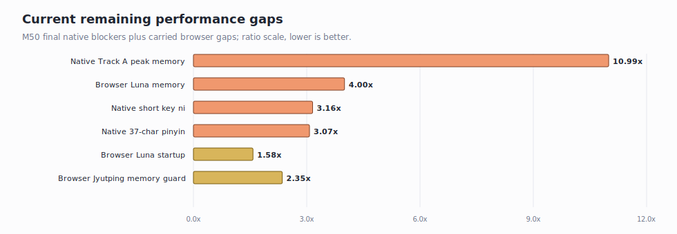
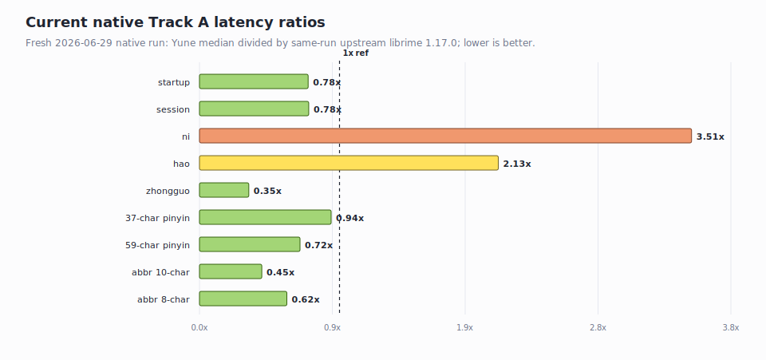
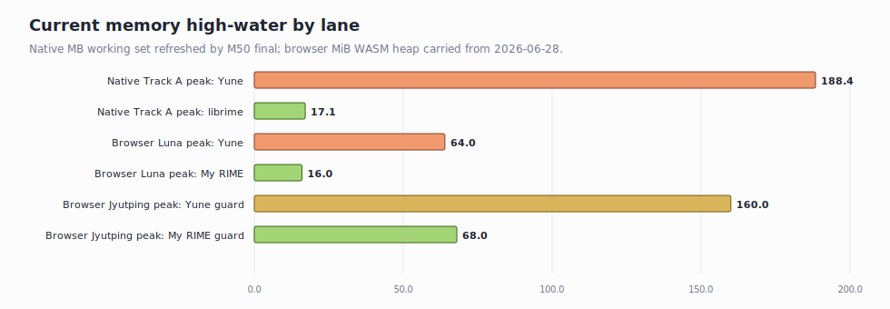

# Current Yune Root-Cause Dashboard

Date: 2026-06-29

This report keeps only the current root-cause read. Older milestone narratives,
WEB-01/WEB-02/WEB-03 closeout detail, and superseded measurements remain in
[`history/2026-06-28-yune-vs-librime-root-cause-analysis-pre-current-dashboard.md`](./history/2026-06-28-yune-vs-librime-root-cause-analysis-pre-current-dashboard.md).

The native lane was refreshed by the M50 Track A final benchmark on
2026-06-29; browser rows are carried forward from the 2026-06-28 Playwright run.

## Technical Summary

- **Current native latency owner**: M50 closed `n` back inside the
  launch-readiness gate at `2.877x` (`61.000 us` vs `21.200 us`), but `ni`
  remains a blocker at `3.156x` (`45.450 us` vs `14.400 us`). `hao` remains
  under the 3x gate at `2.161x`.
- **Current long-row owner**: M48's full Luna preset vocabulary introduced a
  large sentence-model scan cost. M50 reduced the 37-character row in
  intermediate evidence, but the final same-run benchmark still records it just
  above the 3x gate at `3.074x`. The 59-character row remains under gate at
  `2.277x`.
- **Current native memory owner**: Track A peak working set is now `188.4 MB`
  versus librime's `17.1 MB` max peer peak. This is the post-M48 full
  `luna_pinyin` preset-vocabulary shape, not the M47 TypeDuck keyboard profile.
- **Current browser fair memory owner**: the fair `luna_pinyin` browser gap is
  `64.0 MiB` Yune public demo versus `16.0 MiB` My RIME (carried 2026-06-28).
- **Current Jyutping launch state**: the shipping public-demo Jyutping path is
  byte-backed at `160.0 MiB`, not the old `893.1 MiB` source-fallback shape.

## Current Gap Map

| Area | Current root cause | Evidence | Current status |
| --- | --- | --- | --- |
| Native Track A peak memory | Post-M48 full Luna preset-vocabulary/process residency | Yune peak `188.4 MB`; librime max peer peak `17.1 MB` | blocker |
| Native `ni` | Exact-row scan under charset filtering without a retained acceptance index | `45.450 us` vs librime `14.400 us`; `3.156x` | blocker |
| Native 37-char pinyin | Preset-vocabulary sentence-model graph rebuild cost | `890.689 us` vs librime `289.773 us`; `3.074x` | blocker |
| Browser `luna_pinyin` memory | Yune WASM/runtime floor still larger than My RIME | `64.0 MiB` vs `16.0 MiB`; same schema (carried) | blocker |
| Browser `luna_pinyin` startup | Yune public-demo startup still slower | `1000 ms` vs My RIME `634 ms` (carried) | watch |
| Browser Jyutping | Larger TypeDuck profile; not a peer-comparable lane | Yune `160.0 MiB`, My RIME Jyutping `68.0 MiB` on different dictionary (carried) | guard only |

## Native Track A Cause

M49 and M50 changed four owners:

- The MARISA-backed compact-table prefix iterator now stores traversal code on
  frames and lazily yields entry rows instead of materializing every row under a
  matching code group up front. That reduced short-prefix cost but not enough to
  pass the strict `<=3.0x` gate.
- The normal preset-vocabulary sentence path now performs a transient
  character-code prefilter before expensive phrase-code derivation. That avoided
  retaining a large prefix index and reduced the 37/59-character post-M48
  regression substantially.
- M50 stopped retaining unused `WordGraphEntry.code` strings in sentence graph
  edges and derives phrase codes with in-place string extension.
- M50 avoided bounded lookup raw-comment cloning when comments are empty or
  entry-code-derived, and added empty-set fast paths for Track A dictionary
  exclusion and spelling-abbreviation checks.

Current native latency rows:

| Row | Yune median | librime median | Ratio | Current cause |
| --- | ---: | ---: | ---: | --- |
| `n` | `61.000 us` | `21.200 us` | `2.877x` | under gate |
| `ni` | `45.450 us` | `14.400 us` | `3.156x` | exact-row scan under charset filtering |
| `hao` | `25.067 us` | `11.600 us` | `2.161x` | under gate |
| 37-char pinyin | `890.689 us` | `289.773 us` | `3.074x` | preset-vocabulary graph rebuild cost |
| 59-char pinyin | `1,543.071 us` | `677.731 us` | `2.277x` | under gate |

The short-key owner counters show no upstream sentence-model calls for `n`,
`ni`, or `hao`. The remaining `ni` work is in exact-row scan under charset
filtering: final M37 metrics show `196` lookup views, `14` materialized
candidates, and `27.450 us` short-key filter time for the two-key sequence. The
37-character row is separate: final M37 metrics show `3,950` vocabulary entries
considered and `22,206.150 us` graph rebuild time on the median sample.

Metric comparability note: M50 narrowed what
`m37_record_owned_candidate_materialization` records for the optimized
`LookupCandidate` path. The related diagnostic columns remain useful inside the
M50 evidence lane, but they are not directly comparable with pre-M50 runs. The
same-run end-to-end benchmark rows are the authority for latency claims.

## Native Memory Cause

Native Track A memory is again a current blocker in the post-M48 shape:

| Measurement | Current value | Read |
| --- | ---: | --- |
| Yune Track A max peak working set | `188.4 MB` | post-M48 full Luna preset-vocabulary/process high-water |
| librime Track A max peer peak | `17.1 MB` | same-run peer scale |
| Maximum Track A private-bytes proxy | `197.2 MB` | Windows proxy, not iOS `phys_footprint` |
| Session-create working set row | `188.4 MB` | not a transient-only spike |
| Largest named reducible owner in final run | `poet.vocabulary`, `53.6 MB` | now attributed, still retained heap |
| Process unclassified lower bound | `106.2 MB` | carried measured blocker after named owner attribution |

This does **not** invalidate M47. M47's comments-intact `jyut6ping3_mobile`
keyboard profile remains the separate iOS-target lane and reports `~22 MB`
private in the lean native probe. The `188.3 MB` value here is the full
`luna_pinyin` Track A peer-comparison harness after M48 loaded the upstream
preset vocabulary.

The `jyut6ping3_mobile` heavy benchmark row still shows the M47 byte-backing win:
private bytes are `183.9 MB` on the key-load row versus `420.0 MB` in the older
run, with peak working set flat because deploy/compile transient work dominates
that harness.

## Browser Root Cause

Carried forward from the 2026-06-28 Playwright run.

The fair browser target is `luna_pinyin`, not Jyutping:

| Scenario | Ready | Input -> candidate | Commit | WASM peak | Resource payload | Read |
| --- | ---: | ---: | ---: | ---: | ---: | --- |
| Yune public demo `luna_pinyin` | `1000 ms` | `74 ms` | `107 ms` | `64.0 MiB` | `29.5 MiB` | fair Yune row |
| My RIME live `luna_pinyin` | `634 ms` | `95 ms` | `119 ms` | `16.0 MiB` | `8.5 MiB` | fair peer row |

The fair gap remains `4.0x`; startup and WASM memory are the browser-side
blockers. Jyutping remains a launch guard lane, not a peer lane, because the
dictionary families differ.

## Current Evidence

Key normalized tables:

- [`current-native-track-a.csv`](./evidence/current-performance-dashboard-2026-06-29/current-native-track-a.csv)
- [`current-native-track-b.csv`](./evidence/current-performance-dashboard-2026-06-29/current-native-track-b.csv)
- [`current-root-cause-gaps.csv`](./evidence/current-performance-dashboard-2026-06-29/current-root-cause-gaps.csv)
- [`current-browser-peer-comparator.csv`](./evidence/current-performance-dashboard-2026-06-29/current-browser-peer-comparator.csv) (carried 2026-06-28)
- [`current-yune-browser-input-latency.csv`](./evidence/current-performance-dashboard-2026-06-29/current-yune-browser-input-latency.csv) (carried 2026-06-28)

Fresh native source:
[`evidence/m50-track-a-launch-readiness/final-native-benchmark/`](./evidence/m50-track-a-launch-readiness/final-native-benchmark/).

## Next Diagnostic Order

| Rank | Work | Why this is next |
| ---: | --- | --- |
| 1 | Native Track A process-level memory gap | Current full Luna Track A is `188.4 MB` peak / `197.2 MB` maximum private proxy, far above librime even after naming `poet.vocabulary`. |
| 2 | Native `ni` exact-row scan | `ni` remains `3.156x` because the bounded path scans many exact rows under charset filtering without a retained acceptance index. |
| 3 | Native 37-character sentence-model cost | The row is still `3.074x` in the final same-run benchmark. |
| 4 | Browser fair-lane memory floor on `luna_pinyin` | Same-schema browser gap is `64.0 MiB` vs `16.0 MiB`. |
| 5 | Browser startup phases | Yune public-demo `luna_pinyin` ready-to-input is `1000 ms` vs My RIME `634 ms`. |

## History

Archived milestone-style report:
[`history/2026-06-28-yune-vs-librime-root-cause-analysis-pre-current-dashboard.md`](./history/2026-06-28-yune-vs-librime-root-cause-analysis-pre-current-dashboard.md).
