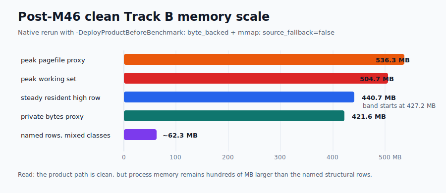
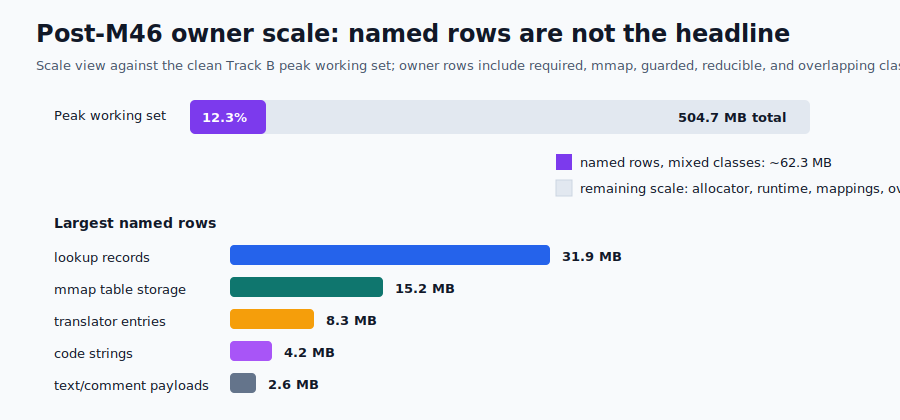
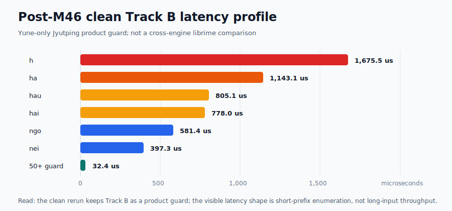

# Yune vs upstream librime root-cause dashboard

Date: 2026-06-28

This report explains current native-engine evidence and the separately measured
browser/WASM launch-path evidence. Native Track A claims remain native-only;
browser/public-demo claims are made only where real-browser evidence is linked.

## Current Verdict

M45 closes as a partial native-engine root-cause milestone. It improves the
memory accounting and confirms the short-key behavior guard, but it does not
close the remaining `n`/`ni` short-prefix ratio gap or the real peak-memory
cost. Phase 0 selected `short-key-measured-no-go`, so M45 did not retain a
short-key engine implementation branch.

Measured outcomes:

- `hao` remains inside target at `24.267 us`, `2.110x` same-run upstream
  librime. This preserves the M44 `hao` pass; it is not a new M45 speed win.
- `n` is now the clearest short-prefix blocker: `68.900 us`, `3.313x`.
- `ni` remains a blocker: `49.450 us`, `3.458x`.
- Short-key candidate output for `n`, `ni`, and `hao` matches upstream
  librime `1.17.0`.
- Steady Track A resident memory is below `107,797,708 B`, but first startup
  still records `127,475,712 B` peak working set, so peak memory is not solved.

Latest review snapshot:
[`./evidence/reframed-comparison-review-2026-06-27/`](./evidence/reframed-comparison-review-2026-06-27/).
It confirms the same Track A conclusion with normal run-to-run noise:
`hao 2.199x`, `n 3.534x`, and `ni 3.698x`, with a `128,364,544 B` Track A peak.
Those precise values are recorded only in the run-labeled evidence; public
summary docs use ranges for short-key ratios.

Do not use that snapshot's native Track B rows for product root cause. The run
omitted `-DeployProductBeforeBenchmark`; Track B status is
`compiled_ready=false`, `selected_storage=unavailable`, and
`source_fallback=true`, producing a `510,925,748 B`
`translator.entries_by_code` source-YAML fallback BTreeMap and about `1.05 GB`
peak. M46's byte-backed `source_fallback=false` evidence remains the valid Track
B product memory source.

Clean Track B follow-up:
[`./evidence/reframed-comparison-review-2026-06-27/native-track-b-clean/`](./evidence/reframed-comparison-review-2026-06-27/native-track-b-clean/).
This rerun uses `-DeployProductBeforeBenchmark` and records
`compiled_ready=true`, `selected_storage=byte_backed`, table/prism `mmap`, and
`source_fallback=false`. It confirms M46's root-cause read: Track B still peaks
at `504,676,352 B`, steady rows stay in the `427-441 MB` band, and the largest
named product owner remains `compact_table.lookup_records` at `31,920,140 B`.

WEB-03 follow-up evidence resolves the public-demo Jyutping source-fallback
owner that WEB-02 named. The launch compiled assets are current `Rime::Prism/4.0`
payloads, native diagnostics byte-back all three public schemas, and the
browser shipping/full Jyutping rows now peak and settle at `160.0 MiB`. The old
`893.1 MiB` row remains only as a synthetic no-launch-assets control.

The WEB-03 memory closeout needed a correctness follow-up: `d4d84203` recorded
the real `160.0 MiB` browser memory result but did not run the full native
`yune_web` suite. The regenerated byte-backed Jyutping path initially failed
multi-syllable phrase composition (`ngogokdak -> 我覺得`) and visible
`zouhapci` prefix lookup rows. The fix resolves non-correction
`Rime::Prism/4.0` aliases for sentence substrings and prefix fallback probes,
then preserves TypeDuck order by consumed prefix length, dictionary weight, and
stable emission order.

## M45 Cause Map

| Area | Pre-M45 cause | M45 evidence | Current status |
| --- | --- | --- | --- |
| Track A `n` | Post-M44 diagnostic showed the one-letter row as the sharpest short-prefix owner. | Final `68.900 us`, `3.313x`; behavior guard passes; sentence model calls remain `0`. | Target missed; measured benchmark-parity blocker. |
| Track A `ni` | Same short-prefix translator/prefix path remained above target after M44. | Final `49.450 us`, `3.458x`; behavior guard passes; sentence model calls remain `0`. | Target missed; measured benchmark-parity blocker. |
| Track A `hao` | M44 had already reduced surplus short-key work enough to pass the ratio gate. | Final `24.267 us`, `2.110x`; behavior guard passes. | Target met. |
| Track A long rows | M40 full-pinyin sentence lookup path must stay isolated from short-key work. | Final ratios `0.939x` and `0.720x`; no M45 short-key or abbreviation regression recorded. | Guard passed. |
| Track A abbreviations | M42/M44 behavior and bounded-ranking improvements must remain intact. | Final `cszysmsrsd` `0.440x` and `zybfshmsru` `0.640x`, with candidate-output parity preserved. | Guard passed. |
| Track A memory | M43/M44 retained-owner reductions did not explain process peak. | Steady rows are `87-99 MB`; first startup and all rows retain `127,475,712 B` peak. | Resident target met; peak is a standing blocker. |

## Short-Key Root Cause

M45 proves the short-key gap is behavior-comparable: upstream librime and Yune
candidate output match for `n`, `ni`, and `hao`, including first-page text,
comments, order, preedit, commit preview, and page metadata.

The remaining root cause is not the sentence path. Final owner counters show
`upstream_sentence_model_calls=0` and small first-page materialization costs on
the short-key rows:

The `Prefix lookup` and `First-page materialize` columns are sub-operation
times from the metrics-instrumented run, whose total process-key time is higher
than the clean `Yune median` (for example `ni` instruments at `96.900 us`).
They show which owner dominates, not exact shares of the clean median.

| Row | Yune median | Ratio | Prefix lookup | Rows scanned | First-page materialize | Read |
| --- | ---: | ---: | ---: | ---: | ---: | --- |
| `n` | `68.900 us` | `3.313x` | `35.100 us` | `7` | `1.700 us` | Prefix/translator constant factor still too high. |
| `ni` | `49.450 us` | `3.458x` | `35.600 us` | `14` | `5.200 us` | Prefix/translator constant factor still too high. |
| `hao` | `24.267 us` | `2.110x` | `9.300 us` | `21` | `8.600 us` | Ratio target met. |

M45 does not retain a short-key implementation branch because the explored
bounded table-range experiment did not move the measured target. The final
`n`/`ni` medians should therefore be read as fresh same-run evidence and
candidate-output parity proof, not as optimization progress from M45. The next
slice needs a narrower constant-factor owner before changing the translator
path. Because the misses are tens of microseconds, the blocker is recorded as
benchmark-parity work rather than a perceptible typing UX blocker.

## Memory Root Cause

M45 adds private-byte and peak-pagefile columns to the native benchmark harness
and uses them to split steady resident memory from high-water peak.

| Measurement | Final value | Read |
| --- | ---: | --- |
| Session steady working set | `87,498,752 B` | Below resident target. |
| Startup steady working set | `90,161,152 B` | Below resident target. |
| `n` steady working set | `91,058,176 B` | Below resident target. |
| Highest Track A steady row | `98,684,928 B` | Below resident target. |
| Track A max peak working set | `127,475,712 B` | Standing peak-cost blocker. |
| Track A max peak pagefile | `112,218,112 B` | Peak-cost signal. |

The first startup sample starts at `4,722,688 B`, reaches `90,161,152 B` after
ready, finalizes to `87,248,896 B`, and still records `127,475,712 B` peak
working set. That prevents M45 from classifying the high-water value as a pure
benchmark-cumulative artifact.

Retained owner evidence also does not name a new safe peak-moving rewrite:

| Owner | Class | Retained estimate | Read |
| --- | --- | ---: | --- |
| `poet.entries_by_code` | heap-owned reducible | `18,694,662 B` | Largest reducible owner, already reduced in M43. |
| `compact_table.storage` | mmap file-backed | `13,013,460 B` | File-backed selected storage, not a heap mirror. |
| `poet.lookup_index` | heap-owned guarded | `2,660,848 B` | Required by M40 performance. |
| Small reducible owners | heap-owned reducible | `30,875 B` | Too small to move process peak. |

M45 therefore closes memory as resident-target success with a standing peak
blocker, not as full memory success.

## Guardrails Preserved

| Gate | M45 final evidence |
| --- | --- |
| Startup/session | Startup `0.875x`, session `0.921x` same-run librime; no startup/session speed claim. |
| `zhongguo` | `61.225 us`, `0.373x` same-run librime. |
| M40 long rows | `0.939x` and `0.720x`; full-pinyin path remains separate. |
| M42/M44 abbreviations | `0.440x` and `0.640x`; candidate-output guard remains preserved. |
| Short-key output | `n`, `ni`, and `hao` match upstream candidate output. |
| Track A storage | `selected_storage=rsmarisa_byte_backed`, table/prism mmap, heap mirrors `0`, `source_fallback=false`, positive `rsmarisa` counters. |
| Track B storage | Deployed profile remains source-fallback-free; M45 makes no Track B speed claim. |

## Evidence

- M45 evidence root:
  [`./evidence/m45-native-short-key-memory-attribution/`](./evidence/m45-native-short-key-memory-attribution/)
- M45 phase-0 benchmark:
  [`./evidence/m45-native-short-key-memory-attribution/phase-0-native-baseline/`](./evidence/m45-native-short-key-memory-attribution/phase-0-native-baseline/)
- M45 phase-0 candidate oracle:
  [`./evidence/m45-native-short-key-memory-attribution/phase-0-short-key-oracle/`](./evidence/m45-native-short-key-memory-attribution/phase-0-short-key-oracle/)
- M45 phase-0 verdict:
  [`./evidence/m45-native-short-key-memory-attribution/phase-0-verdict.md`](./evidence/m45-native-short-key-memory-attribution/phase-0-verdict.md)
- M45 final benchmark:
  [`./evidence/m45-native-short-key-memory-attribution/final-native-benchmark/`](./evidence/m45-native-short-key-memory-attribution/final-native-benchmark/)
- M45 final candidate comparison:
  [`./evidence/m45-native-short-key-memory-attribution/final-candidate-comparison/oracle-vs-yune-candidate-output.md`](./evidence/m45-native-short-key-memory-attribution/final-candidate-comparison/oracle-vs-yune-candidate-output.md)
- M45 final memory attribution:
  [`./evidence/m45-native-short-key-memory-attribution/final-memory-attribution.md`](./evidence/m45-native-short-key-memory-attribution/final-memory-attribution.md)
- M45 visual evidence:
  [`./evidence/m45-native-short-key-memory-attribution/visuals/`](./evidence/m45-native-short-key-memory-attribution/visuals/)
- M45 final gates:
  [`./evidence/m45-native-short-key-memory-attribution/final-native-benchmark/final-gates.md`](./evidence/m45-native-short-key-memory-attribution/final-native-benchmark/final-gates.md)

Historical predecessor evidence remains under
[`./evidence/m44-native-performance-owner-reduction/`](./evidence/m44-native-performance-owner-reduction/).

## M46 Track B/Jyutping Memory Attribution

M46 closes as a useful partial result with measured memory blockers. It does
not change the M45 Track A verdict. It attributes the TypeDuck/Jyutping Track B
native memory and the yune-web Jyutping WASM high-water, fixes the
product-affecting multi-schema browser correctness blocker, and stops before a
storage rewrite because the headline memory owner remains mostly unclassified.

Fresh M46 Phase 0 native evidence keeps the Track B product path
source-fallback-free while confirming the headline memory blocker:

| Measurement | Value | Read |
| --- | ---: | --- |
| Track B peak working set | `504,627,200 B` | Real high-water remains. |
| Track B steady resident band | `427,356,160-442,966,016 B` | Resident footprint remains large. |
| Track B private bytes proxy | `423,641,088 B` | Private memory is also large. |
| Track B peak pagefile proxy | `535,744,512 B` | Peak pressure is visible outside working set. |

New owner rows explain only part of that headline:

| Owner | Class | Estimate | Read |
| --- | --- | ---: | --- |
| `compact_table.lookup_records` | heap-owned required | `31,920,140 B` | Largest named owner; required for dictionary panels. |
| `compact_table.storage` | mmap file-backed | `15,248,382 B` | Base table selected storage, not a heap mirror. |
| `translator.entries_by_code` | heap-owned guarded | `8,327,700 B` | Guarded/source-YAML or small-test state. |
| `compact_table.syllabary_codes` | heap-owned reducible | `4,189,674 B` | Too small to justify a headline `rsmarisa` branch. |
| candidate text/comment payload | shared/overlapping | `2,575,292 B` | Visible but overlapping and small. |

The clean post-M46 rerun visualizes the same shape: process memory remains in
the hundreds of MB while named rows remain tens of MB. Treat the owner chart as
a scale view, not a strict additive heap decomposition, because rows mix
required heap, mmap file-backed bytes, guarded translator state, and overlapping
logical payloads.

M46 Phase 0 therefore did not authorize a Track B `rsmarisa`, payload, scolar,
reverse-index, or transient memory optimization branch. It selected
`schema-switch-regression-fix-first`, because browser evidence showed
Cangjie -> Luna -> Jyutping returning zero Jyutping candidates in a current
post-WEB-01 multi-schema session.

Branch A fixed that correctness blocker. Post-fix browser evidence shows clean
Jyutping, Cangjie -> Luna -> Jyutping, and Jyutping -> Luna -> Jyutping all
return `nei -> 你` with six candidates, zero worker action errors, and the same
`893.1 MiB` WASM high-water.

The same clean rerun also keeps Track B latency framed as a Yune-only product
guard. Short-prefix rows remain the heavy cases, while the 50+ guard stays
small; this is not a fair cross-engine comparison lane.

M46 therefore records `schema-switch-correctness-fixed-memory-unchanged` and
`measured-no-go-owner-unclassified`. No native Track B or browser WASM memory
success is claimed.

M46 evidence:
[`./evidence/m46-jyutping-native-wasm-memory-attribution/`](./evidence/m46-jyutping-native-wasm-memory-attribution/).

## WEB-02 Public-Demo Jyutping Owner Classification

WEB-02 closes the M46 browser-owner gap for the public-demo Jyutping path. The
measured web ABI path now reports `source_fallback=true`,
`selected_storage=owned_heap`, and `byte_source_len=0`, with fallback reason
`source fallback after compiled reject: Invalid("prism parse failed:
UnsupportedVersion")`.

The shipped public-demo Jyutping compiled assets explain the fallback:

| Asset | Shipped header | WEB-02 read |
| --- | --- | --- |
| `jyut6ping3_mobile.prism.bin` | `Rime::Prism/3.0` | rejected by current compact-prism parser |
| `jyut6ping3_scolar.prism.bin` | `Rime::Prism/3.0` | rejected by current compact-prism parser |
| `luna_pinyin.prism.bin` | `Rime::Prism/4.0` | current-format comparison point |

The retained owner is engine heap at runtime, but the root cause is
web/public-demo artifact delivery: this path ships old Jyutping prism payloads
and does not leave current generated Jyutping compiled files in `user/build`.
The live owner rows are:

| Owner | Selected storage | Retained estimate | Items |
| --- | --- | ---: | ---: |
| `translator.entries_by_code` | `owned_heap` | `510,925,748 B` | `1,139,357` |
| `translator.entries_by_code` | `owned_heap` | `18,676,626 B` | `70,805` |
| **Total reported retained owner** |  | **`529,602,374 B` (`505.1 MiB`)** |  |

This does not claim a browser memory win: the known Jyutping browser high-water
remains `893.1 MiB`. It changes the next action from generic payload or
`INITIAL_MEMORY` experiments to a measured target: fix the public-demo/browser
compiled-asset contract so Jyutping selects current byte-backed storage, then
rerun the browser high-water measurement.

Evidence:
[`./evidence/web02-jyutping-wasm-memory-attribution/`](./evidence/web02-jyutping-wasm-memory-attribution/).

## WEB-03 Launch Asset Contract Closeout

WEB-03 found the upstream cause behind the stale browser assets: Yune deploy
treated `table_translator@custom_phrase` with `dictionary: ''` as a buildable
dictionary, emitted an empty dictionary-id build request, and aborted clean
rebuilds for schemas that imported that standard namespace. The engine fix
skips empty dictionary namespaces, matching librime behavior. The asset slice
then regenerated and shipped current launch assets for `jyut6ping3_mobile`
including `jyut6ping3_scolar` and `luna_pinyin_yune_reverse`, `cangjie5`, and
`luna_pinyin`.

Native diagnostics now prove the intended storage path before browser launch:
`source_fallback=false`, zero fallback rows, `selected_storage=byte_backed`, and
positive `byte_source_len` for all three public schemas. Cangjie also has the
minimum correctness smoke: `cangjie5` input `a` returns U+65E5 first.

Fresh browser evidence after the regenerated assets records:

| Browser row | Max WASM | Ready | Input-to-candidate | Commit | Read |
| --- | ---: | ---: | ---: | ---: | --- |
| public-demo `full-jyutping` | `160.0 MiB` | `1306 ms` | `100 ms` | `110 ms` | Shipping full launch path byte-backs. |
| public-demo `jyutping-core` | `160.0 MiB` | `1096 ms` | `80 ms` | `110 ms` | Core Jyutping byte-backs. |
| public-demo schema-switch | `160.0 MiB` | n/a | n/a | n/a | Jyutping, Cangjie, Luna switch and type. |
| public-demo `extras` | `893.1 MiB` | `5178 ms` | `72 ms` | `117 ms` | Negative control: launch assets withheld. |

WEB-03 therefore changes the WEB-02 browser-root-cause verdict: the shipped
launch path no longer owns a `529,602,374 B` source-fallback dictionary heap.
It does not change the native Track B `504 MB` memory result, does not claim a
native memory win, and does not solve the fair browser `luna_pinyin` memory gap
against My RIME (`160.0 MiB` versus `16.0 MiB`).

Second post-closeout correction: the phrase-composition repair introduced a
long-input Jyutping latency regression. A live deployed probe on 2026-06-28
showed the memory fix was still intact (`160.0 MiB`), but long typing was not:
`sihaacoenggeoisyujapgecukdou` reached `3764 ms` exact keydown-to-paint and
`taihaajyugwodaahoucoenggegeoizigosingnangwuidimjoeng` reached `1518 ms`. The
owner was not assets or WASM heap growth; it was compact-path sentence/prefix
fallback expansion materializing and sorting too many hidden rows after alias
resolution.

The fix bounds that work while preserving the alias behavior needed for
`ngogokdak` and `zouhapci`:

- sentence alias lookup asks the prism only for the codes the sentence path can
  consume;
- sentence spans cap candidates per span;
- prefix fallback sorts a small capped pending set instead of every matching
  dictionary row.

Rebuilt local public-demo evidence records:

| Input | Deployed pre-fix | Rebuilt local fix | Memory |
| --- | ---: | ---: | ---: |
| `caksi` | `299 ms` | `89 ms` | `160.0 MiB` |
| `ngogokdak` | `160 ms` | `22 ms` | `160.0 MiB` |
| `sihaacoenggeoisyujapgecukdou` | `3764 ms` | `130 ms` | `160.0 MiB` |
| `taihaajyugwodaahoucoenggegeoizigosingnangwuidimjoeng` | `1518 ms` | `74 ms` | `160.0 MiB` |

The final Jyutping-only sanity check after the last WASM rebuild records the
same two long rows at `142 ms` and `78 ms`, also with ready/peak WASM memory at
`160.0 MiB`.

The follow-up guard now covers both long Jyutping rows, asserts their expected
first candidates, and caps byte-backed prefix/sentence expansion counters. That
turns the user-visible latency row into a standing regression dimension instead
of another one-off browser measurement.

Post-closeout correction: the phrase-composition regression is now fixed and
gated. Final follow-up evidence records full native `yune_web` 33/0 with 2
ignored evidence-only tests, `cantonese_parity` 37/0, WEB-03 byte-backed guard
coverage for `ngogokdak -> 我覺得`, and browser public-demo smoke for both
`ngogokdak -> 我覺得` and the `zouhapci` visible dictionary rows.

Evidence:
[`./evidence/web03-three-schema-launch-readiness/`](./evidence/web03-three-schema-launch-readiness/).
Follow-up evidence:
[`./evidence/web03-three-schema-launch-readiness/phrase-composition-regression-fix/final-gates.md`](./evidence/web03-three-schema-launch-readiness/phrase-composition-regression-fix/final-gates.md).
Latency follow-up evidence:
[`../../apps/yune-web/e2e/results/web03-latency-regression-fix/local-browser-latency/`](../../apps/yune-web/e2e/results/web03-latency-regression-fix/local-browser-latency/).

## Memory Synthesis: M43-M46

Four milestones attacked memory and the headline never moved. That convergence
is itself the finding:

- The **structural-owner approach is exhausted.** Named owners explain at most
  about `12%` of the Track B peak (`~60 MB` of `~504 MB`), and the easy
  hypotheses are measured-dead: a Jyutping `rsmarisa` string table saves
  `~4 MB`, not `~200 MB`; candidate text/comment payloads are `~2.5 MB`
  combined; `jyut6ping3_scolar` is mmap source bytes, not a retained owner.
  There is no large reducible structure left to refactor, and M43 already proved
  that shrinking a named owner (`poet.entries_by_code`, `-19.5 MB`) does not
  move process peak.
- The public-demo browser Jyutping source-fallback owner is now fixed on the
  shipping path. WEB-02 proved stale `Rime::Prism/3.0` assets retained
  `529,602,374 B` of `translator.entries_by_code`; WEB-03 regenerated current
  launch assets and remeasured the browser path at `160.0 MiB`. The old
  `893.1 MiB` figure remains only for the negative-control attribution row that
  intentionally withholds launch assets.
- The cross-engine browser comparison is **not like-for-like**, so the size of
  any Yune inefficiency is unquantified. The librime-based My RIME browser build
  runs Jyutping in `68 MiB`, but on the Cantonese-only
  [`rime-cantonese`](https://github.com/rime/rime-cantonese) dictionary. Yune runs
  TypeDuck's `jyut6ping3`, which also carries English, Hindi, Urdu, and Nepali
  entries and is a much larger dataset. So `68 MiB` is **not** a valid target, and
  part of the `893 MiB` is a legitimately bigger dictionary. The init-transient
  evidence above still implies *some* inefficiency — the high-water does not scale
  with loaded asset bytes — and the fair same-schema baseline below quantifies it.
- **The fair same-schema baseline gives the answer: ~10x.** On `luna_pinyin` —
  same schema, same dictionary, no multilingual confound — Yune is roughly `10x`
  heavier than a librime-family engine both natively (`127 MB` vs librime
  `13-17 MB`) and in the browser (`160 MiB` vs My RIME `16 MiB`). So the memory
  inefficiency is **real and ~10x**, independent of any Jyutping dictionary
  difference; the Jyutping `893 MiB` is that ~10x base inefficiency plus a larger
  multilingual dictionary on top. The Jyutping number is therefore a guard, not a
  comparison, and the clean target for any memory work is the fair `luna_pinyin`
  gap.

The next memory step, if pursued, should target the fair `luna_pinyin` browser
gap and the remaining runtime high-water floor, not another Jyutping
source-fallback repair. Another native structural-owner pass is not the move;
M43-M46 proved that dry, and WEB-03 already removed the browser launch
source-fallback owner.
