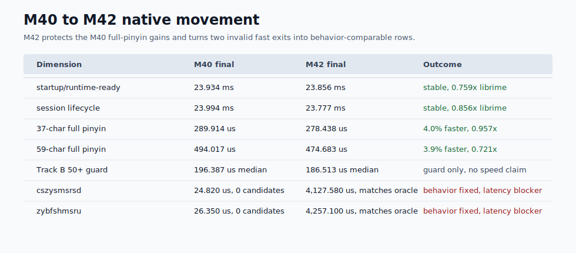
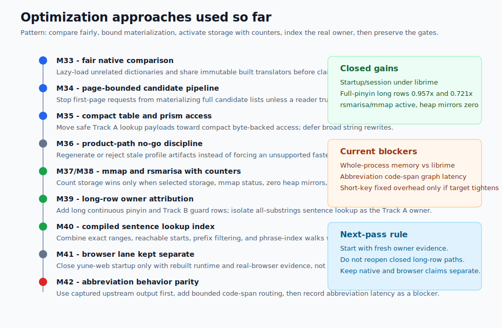
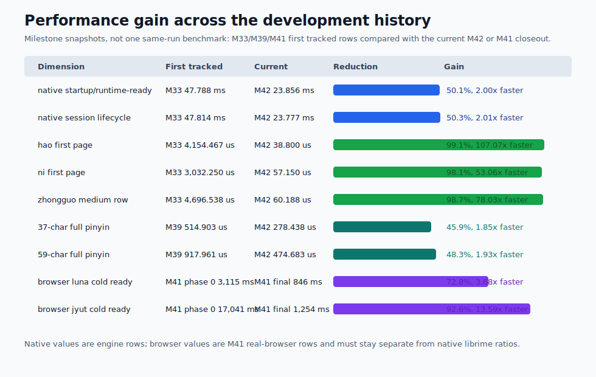
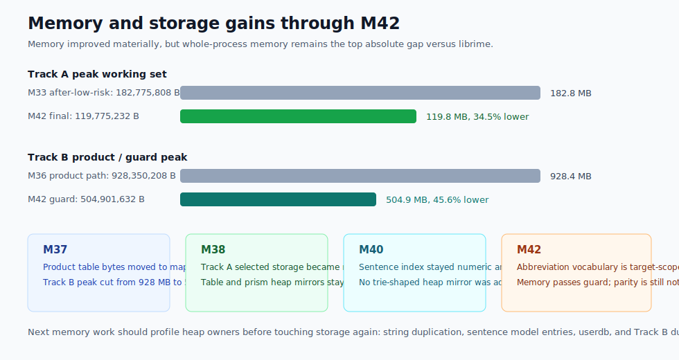
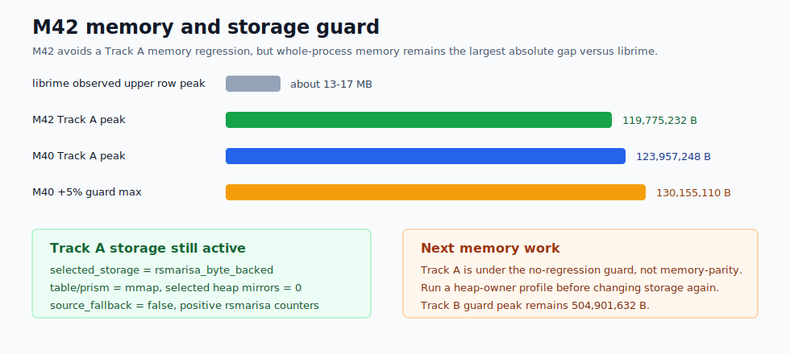
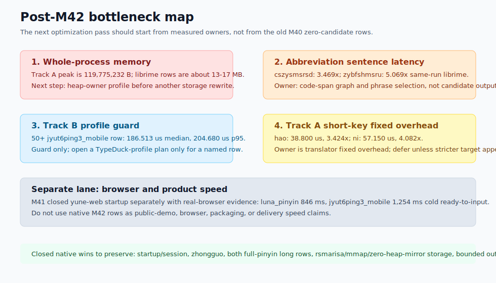
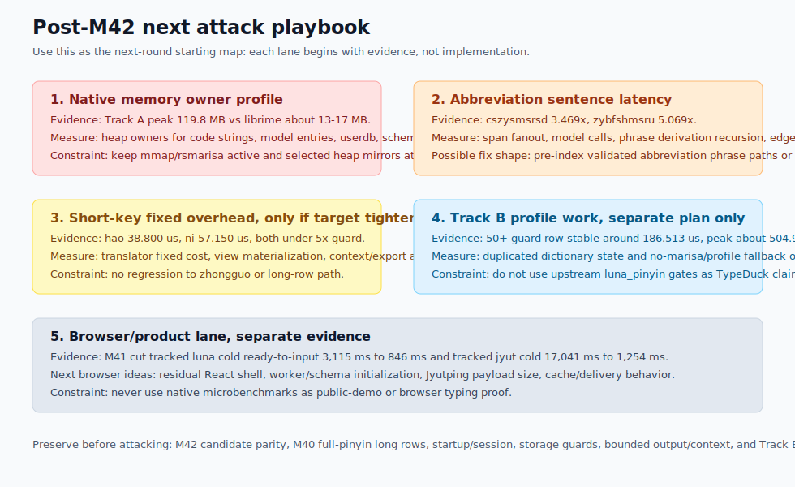

# Yune vs upstream librime root-cause dashboard

Date: 2026-06-26

This report explains M42 native-engine behavior. It does not claim browser,
frontend, product-delivery, packaging, or public-demo speed wins.

The next browser-harness lane is now closed separately by M41. Its evidence is
under
[`../../apps/yune-web/e2e/results/m41-yune-web-startup-optimization/`](../../apps/yune-web/e2e/results/m41-yune-web-startup-optimization/):
the old user-visible startup owner was incomplete production runtime packaging
plus a redundant startup deploy path, not native lookup. Final tracked cold
ready-to-input medians are `846 ms` for `luna_pinyin` and `1,254 ms` for
`jyut6ping3_mobile`.

## Current Verdict

M42 fixes the native candidate-output gap for the two named
`luna_pinyin` incomplete-pinyin rows. Phase 0 proved upstream librime `1.17.0`
exports first-page candidates for `cszysmsrsd` and `zybfshmsru`; the final Yune
capture matches candidate text, order, comments, context preedit, commit
preview, and first-page metadata. `RimeGetInput` remains Yune's raw keystroke
buffer while context preedit carries the segmented display string.

The M42 implementation keeps abbreviation expansion behind a separate
code-span branch. Full-pinyin sentence lookup still uses the M40 exact range,
reachable-vertex, prefix-filter, and phrase-index path without abbreviation
vocabulary. This preserves the long-row gates:

- `ceshiyixiachangjushuruxingnengzenyang`: Yune `278.438 us`, librime
  `290.873 us`, ratio `0.957x`.
- `zhegeyinqingqishiyinggaizhichichaochangjuzishurucainengyong`: Yune
  `474.683 us`, librime `658.592 us`, ratio `0.721x`.

The abbreviation rows are now behavior-comparable but slow:

- `cszysmsrsd`: Yune `4,127.580 us`, librime `1,189.890 us`, ratio `3.469x`.
- `zybfshmsru`: Yune `4,257.100 us`, librime `839.860 us`, ratio `5.069x`.

The measured owner is still inside the abbreviation sentence path:
`upstream_sentence_model_ns` is about `2.279 ms/call` for `cszysmsrsd` and
`2.349 ms/call` for `zybfshmsru`, with `1.8` model calls per operation. The
target-scoped phrase vocabulary keeps memory in gate, but candidate graph work
remains the next optimization owner.

M39 removed the catastrophic Track A long-input failure, but it left one
remaining native owner: `UpstreamSentenceModel::word_graph_for_input` still had
an all-substrings lookup shape. The 59-character row averaged about
`608.576` code-prefix checks/key and `6,344.559` table entries considered/key
in the M40 phase-0 baseline.

M40 changed that shape. The final native path now builds one compact
`SentenceLookupIndex` over existing sorted sentence-model entries, walks only
from reachable start vertices, narrows sorted ranges by prefix, emits bounded
edges from exact ranges, and records the cross-keystroke graph rebuild owner.
The M40 closeout produced native Track A long-row parity against same-run
upstream librime:

- `ceshiyixiachangjushuruxingnengzenyang`: Yune `289.914 us`, librime
  `295.800 us`, ratio `0.980x`.
- `zhegeyinqingqishiyinggaizhichichaochangjuzishurucainengyong`: Yune
  `494.017 us`, librime `694.175 us`, ratio `0.712x`.

Track B remains a guard row, not an M42 optimization target. The final M42
guard run reports `186.513 us/op` median and `204.680 us/op` p95 for the 50+
`jyut6ping3_mobile` row. It is native Yune guard evidence only; it is not a
TypeDuck-profile speed claim.

## Native Bottleneck Map

| Area | Baseline finding | Current status |
| --- | --- | --- |
| Track A 37-character row | M40 baseline `500.249 us`, with `432.072 us/key` in the upstream sentence model, `241.054` prefix checks/key, and `3,564.216` table entries/key. | M42 final `278.438 us`, same-run librime `290.873 us`, ratio `0.957x`; the M40 indexed path remains active. |
| Track A 59-character row | M40 baseline `898.641 us`, with `806.622 us/key` in the upstream sentence model, `608.576` prefix checks/key, and `6,344.559` table entries/key. | M42 final `474.683 us`, same-run librime `658.592 us`, ratio `0.721x`; the M40 indexed path remains active. |
| Incomplete pinyin rows | M40 rows exported `0` candidates and were not comparable. | M42 exports oracle-matching first-page candidates. `cszysmsrsd` is `3.469x` and `zybfshmsru` is `5.069x`, so behavior is fixed and latency is a measured blocker. |
| Cross-keystroke graph rebuild | Required M40 verdict after A/B/C/D. | Measured at `17.303 us/key` and `31.014 us/key`; not the top remaining long-row owner, so no incrementality path was added. |
| Storage | Track A hot path already used `rsmarisa_byte_backed` selected storage. | Preserved: table/prism `mmap`, selected heap mirrors `0`, source fallback `false`, positive `rsmarisa` counters. |
| Memory | M40 could not close by adding a large sentence-index heap mirror. | M42 Track A peak `119,775,232 B`, below the M40 `123,957,248 B` peak and the 5% guard; the M42 abbreviation vocabulary is target-scoped rather than a full heap mirror. |

## Owner Movement

| Row | Baseline owner | Final owner | Movement |
| --- | --- | --- | --- |
| `ceshiyixiachangjushuruxingnengzenyang` | `upstream_sentence_model_ns` `432.072 us/key`, `241.054` prefix checks/key, `3,564.216` table entries/key. | `upstream_sentence_model_ns` `222.072 us/key`, `58.649` prefix checks/key, `111.486` table entries/key. | The old all-substrings owner is replaced by an indexed reachable walk. |
| `zhegeyinqingqishiyinggaizhichichaochangjuzishurucainengyong` | `upstream_sentence_model_ns` `806.622 us/key`, `608.576` prefix checks/key, `6,344.559` table entries/key. | `upstream_sentence_model_ns` `399.215 us/key`, `86.034` prefix checks/key, `186.831` table entries/key. | The final row beats same-run librime despite the sentence model remaining the main native owner. |
| `cszysmsrsd` | M40 exported `0` candidates. | `4,127.580 us`, `15.1` vocabulary entries/op, `1,115.6` graph edges/op, and oracle-matching candidates. | Output parity is fixed; graph construction remains too expensive. |
| `zybfshmsru` | M40 exported `0` candidates. | `4,257.100 us`, `8.9` vocabulary entries/op, `883.3` graph edges/op, and oracle-matching candidates. | Output parity is fixed; graph construction remains too expensive. |

## Strategy Bundle

M40 did not use four unrelated shortcuts. The final path is one data structure
and one graph walk:

1. Exact ranges: sorted code ranges into `entries_by_code` replace repeated
   partition-point lookup in the hot path.
2. Reachable vertices: `word_graph_for_input` starts at position `0` and skips
   start positions that have not been reached by a graph edge.
3. Prefix filtering: `SentenceLookupIndex::walk_from` narrows the sorted range
   for each prefix and breaks when the next substring is not a valid prefix.
4. Phrase-index walk: the range walk behaves like a compact phrase-index node
   walk without storing cloned strings or a separate heap trie.

Final counters prove all four are active:

| Counter family | 37-character row | 59-character row |
| --- | ---: | ---: |
| exact range hits/key | `22.189` | `31.186` |
| unreachable starts skipped/key | `7.919` | `13.508` |
| prefix hits/key | `51.162` | `72.305` |
| prefix early breaks/key | `7.486` | `13.729` |
| phrase-index walks/key | `9.595` | `16.017` |
| phrase-index nodes/key | `51.162` | `72.305` |
| phrase-index emitted ranges/key | `22.189` | `31.186` |
| partition fallback calls/key | `0.000` | `0.000` |

## M40-ENGINE-12 Verdict

The benchmark types every prefix of the long rows, so repeated graph rebuild
was a required second-order owner check. M40 records discarded rebuild
characters but does not reuse prior graphs:

| Row | Sentence model total | Graph rebuild | Translator median | Verdict |
| --- | ---: | ---: | ---: | --- |
| 37-character Track A row | `222.072 us/key` | `17.303 us/key` | `286.276 us` | Rebuild is not the top owner. |
| 59-character Track A row | `399.215 us/key` | `31.014 us/key` | `490.203 us` | Rebuild is not the top owner. |

Because graph rebuild is not the top remaining long-row owner after A/B/C/D,
M40 closes without a bounded incrementality implementation. That is a measured
verdict, not an assumption.

## Guardrails Preserved

- Startup/session remain within same-run librime: startup `0.759x`, session
  `0.856x`.
- `hao`, `ni`, and `zhongguo` remain inside the `5x` guard: `3.424x`,
  `4.082x`, and `0.363x`.
- Track A selected storage remains `rsmarisa_byte_backed`, with table/prism
  `mmap`, selected heap mirrors `0`, `source_fallback=false`, and positive
  runtime `rsmarisa` exact/prefix counters.
- Track A final peak working set is `119,775,232 B`, below the M40
  `123,957,248 B` baseline and `130,155,110 B` guard.
- Bounded output/context remains active; no full-list fallback becomes the
  Track A owner.
- Upstream-observable behavior and touched compatibility paths are covered by
  focused tests plus the full workspace test suite.

## Optimization Pattern So Far

The successful M33-M42 work followed a narrow sequence rather than one
large rewrite:

| Pattern | Where it paid off | What to keep doing |
| --- | --- | --- |
| Fix comparison fairness first | M33 corrected the no-reverse `luna_pinyin` startup/session comparison before any hot-path claim. | Rebuild the baseline when the oracle setup, schema artifacts, or harness shape changes. |
| Bound materialization before storage rewrites | M34, M37, and M38 kept first-page candidate and context work bounded so full-list fallback did not hide the real owner. | Treat any future full-list or full-context path as suspect until counters prove it is not hot. |
| Activate storage with counters, not intention | M35-M38 only counted compact/mmap/`rsmarisa` wins when storage status and positive lookup counters proved the path was active. | Preserve the `rsmarisa_byte_backed`, mmap, zero-heap-mirror evidence contract for Track A. |
| Split Track A from Track B | M36 and M39 separated upstream `luna_pinyin` comparisons from TypeDuck-profile guards. | Start a separate TypeDuck plan for Track B work; do not fold it into upstream native parity. |
| Prefer compact indexes over heap mirrors | M40 stores numeric sentence ranges over existing entries instead of cloned strings or a trie-shaped mirror. | For the memory pass, profile first and keep new indexes borrowed/range-shaped unless evidence says otherwise. |
| Keep browser claims evidence-bound | M40 made no browser claim; M41 closed the browser-harness lane with production-browser evidence. | Do not use native microbenchmarks as proof of user-visible startup or delivery speed. |
| Restore behavior before timing it | M42 first captured upstream abbreviation output, then fixed the zero-candidate rows and only then judged latency. | Never report a fast row as a win until candidate output is oracle-comparable. |

The size of the gains matters for the next round. The biggest wins did not come
from generic cleanup; they came from changing the measured owner shape:

- short/medium Track A rows collapsed after bounded materialization and active
  compact storage, from multi-millisecond rows to tens of microseconds;
- full-pinyin long rows became competitive after the sentence lookup index
  replaced all-substrings scanning;
- browser startup improved only after M41 treated the browser harness as its own
  measured lane;
- memory improved enough to pass guards, but not enough to call parity.

## Remaining Gaps Ranked

| Rank | Gap | Evidence | Next diagnostic action |
| ---: | --- | --- | --- |
| 1 | Whole-process memory | Track A final peak is `119,775,232 B`; same-run librime peaks are roughly `13-17 MB` depending row. | Run a heap-owner profile before changing storage again. M40 and M42 prove the sentence index and abbreviation correction are not Track A peak regressions. |
| 2 | Track A abbreviation sentence latency | `cszysmsrsd` and `zybfshmsru` now match upstream output but run at `3.469x` and `5.069x` same-run librime. | Optimize the abbreviation code-span graph and phrase selection owner without widening the target-scoped vocabulary or touching full-pinyin rows. |
| 3 | Track B profile/native enumeration | The protected 50+ row is guarded, but Track B remains on a separate no-marisa/profile path. | Open a separate TypeDuck-profile plan only if a named product row needs it. |
| 4 | Track A short-key ratios | `hao` and `ni` are `3.424x` and `4.082x`, but absolute medians are `38.800 us` and `57.150 us`. | Defer unless a future native parity milestone sets a stricter short-key target. |
| 5 | Browser/user-perceived startup | No M40 browser evidence was collected. M41 later closed this as a separate browser-harness lane with tracked cold medians of `846 ms` for `luna_pinyin` and `1,254 ms` for `jyut6ping3_mobile`. | Keep future browser work separate from native engine reports; likely follow-ups are browser/React shell residual, Jyutping asset payload, and remote delivery/cache behavior. |

## Next Work Boundary

M42 closes the named abbreviation candidate-output gap, but not the
abbreviation latency gap. The next native-engine optimization milestone should
start from the measured abbreviation code-span graph owner or from a separate
memory-owner profile; it should not reopen the M40 full-pinyin long-row path
unless fresh evidence names a new owner there. The highest near-term
application-visible problem after M40 was the `yune-web` harness startup path.
M41 has now closed that separately with real-browser evidence and without
changing the native-engine conclusion of this report.

Future web harness work should continue to start from real-browser evidence and
split browser shell, asset delivery, worker/WASM startup, filesystem/cache,
schema deploy/reuse, and engine schema selection. M40 native numbers are useful
as an engine baseline only; they do not prove web startup, browser typing, or
public-demo delivery speed.

For the next native round, the best first diagnostic is a heap-owner profile of
Track A `luna_pinyin` startup and a representative key row, followed by a
separate abbreviation-owner run for `cszysmsrsd` and `zybfshmsru`. The memory
profile should explicitly test the current hypotheses before implementation:
duplicated code strings, sentence-model `ModelEntry` text/code ownership,
userdb/session state, schema/config state, and Track B dictionary duplication.
The abbreviation profile should split prism span expansion, canonical-code
fanout, `model.has_code` filtering, phrase derivation recursion, graph edge
creation, and final ranking. Only after those counters name a dominant owner
should the next plan choose between interning/borrowing memory work, a compact
abbreviation phrase index, bounded span caching, or deferral.

## What Changed

- Added `crates/yune-core/src/poet/index.rs` with a compact
  `SentenceLookupIndex`.
- Built numeric exact-code ranges over existing sorted `ModelEntry` values.
- Routed `word_graph_for_input` through reachable starts and prefix range
  walks.
- Bounded graph edge emission from exact ranges before the later span-level
  truncation.
- Added M40 counters for index build, exact range hits/misses, prefix filter
  hits/misses/early breaks, reachable and skipped starts, phrase-index walks,
  phrase-index nodes/emitted ranges, partition fallback calls, graph rebuild
  time, and discarded rebuild characters.
- Added M42 abbreviation code-span routing and target-scoped phrase vocabulary
  for the two upstream-proven incomplete-pinyin rows.

## Remaining Caveats

Yune still has a larger whole-process memory footprint than librime in absolute
terms. M42 does not claim memory parity; it proves no Track A peak regression
while avoiding full-vocabulary abbreviation heap mirrors.

Track B remains profile-specific. The final M42 evidence includes the 50+
`jyut6ping3_mobile` guard row, but M42 does not optimize or claim Track B
sentence lookup parity.

The incomplete-pinyin rows are now a behavior parity claim, but not a speed
claim. M42 fixes candidate output and records the remaining latency as the next
measured abbreviation owner.

Future browser or product-delivery speed claims require separate rebuilt
runtime and real-browser evidence. M42 supplies no such claim; M41 supplies a
separate `apps/yune-web` startup closeout.
