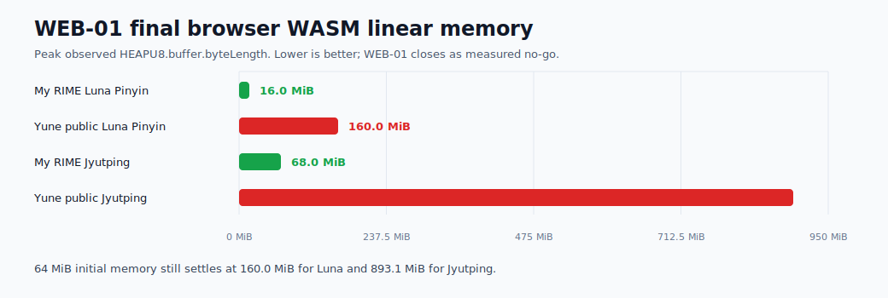
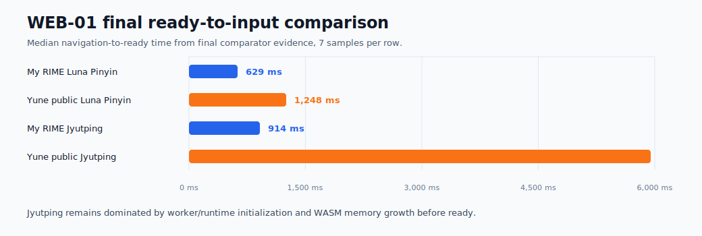
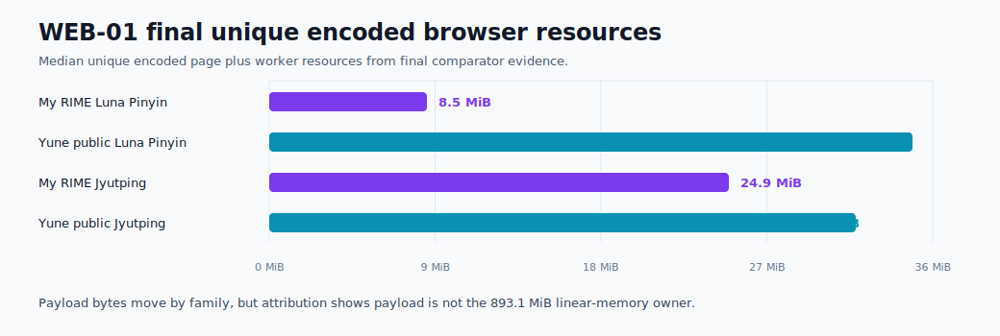

# Yune Web vs My RIME Browser Baseline And WEB-01 Closeout

Date: 2026-06-27

## Scope

This is the WEB-01 browser-harness closeout for `apps/yune-web`, isolated from
native engine optimization and labelled post-M45. It compares freshly rebuilt
local `yune-web` production artifacts against the open-source My RIME
deployment at <https://my-rime.vercel.app/>, then records the lower
`INITIAL_MEMORY` calibration and asset-family attribution.

This report must not be used as a native-engine, M44/M45, packaging,
deployment, public-demo speed, or product-delivery claim. It is only about
browser WASM linear memory, browser startup, worker resources, and
browser-harness evidence.

The closeout plan is:

- [`docs/plans/completed/web01-plan-yune-web-wasm-heap-payload-optimization.md`](../plans/completed/web01-plan-yune-web-wasm-heap-payload-optimization.md)

## Evidence

Yune samples used fresh local production outputs from direct `main` after M45:

- `apps/yune-web/dist`
- `apps/yune-web/public-demo/dist`
- `apps/yune-web/public/yune-web.js`: `72,378 B`
- `apps/yune-web/public/yune-web.wasm`: `2,594,503 B`

The checked-in reusable benchmarks are:

- `apps/yune-web/e2e/yune-web-comparator-benchmark.spec.ts`
- `apps/yune-web/e2e/startup-benchmark/comparator-metrics.ts`
- `apps/yune-web/e2e/yune-web-wasm-attribution.spec.ts`

Fresh post-M45 evidence was generated under:

- `apps/yune-web/e2e/results/yune-web-vs-my-rime-baseline/post-m45-baseline/`
- `apps/yune-web/e2e/results/yune-web-vs-my-rime-baseline/final/`
- `apps/yune-web/e2e/results/yune-web-wasm-heap-optimization/attribution/post-m45-baseline-attribution/`
- `apps/yune-web/e2e/results/yune-web-wasm-heap-optimization/attribution/final-attribution/`
- `apps/yune-web/e2e/results/yune-web-wasm-heap-optimization/initial-memory-67108864-post-m45/`
- `apps/yune-web/e2e/results/yune-web-wasm-heap-optimization/initial-memory-50331648-post-m45/`
- `apps/yune-web/e2e/results/yune-web-wasm-heap-optimization/final/`

Final commands:

```powershell
$env:YUNE_WEB_WASM_HEAP_BENCHMARK='1'
$env:YUNE_WEB_BENCHMARK_SAMPLES='3'
$env:YUNE_WEB_BENCHMARK_PHASE='final'
npm.cmd --prefix apps/yune-web/e2e run test:e2e -- --grep "YUNE WEB WASM HEAP" --workers=1
```

```powershell
$env:YUNE_WEB_WASM_ATTRIBUTION='1'
$env:YUNE_WEB_WASM_ATTRIBUTION_PHASE='final-attribution'
npm.cmd --prefix apps/yune-web/e2e run test:e2e -- --grep "YUNE WEB WASM ATTRIBUTION" --workers=1
```

```powershell
$env:YUNE_WEB_COMPARATOR_BASELINE='1'
$env:YUNE_WEB_COMPARATOR_INCLUDE_MY_RIME='1'
$env:YUNE_WEB_COMPARATOR_SAMPLES='7'
$env:YUNE_WEB_COMPARATOR_PHASE='final'
npm.cmd --prefix apps/yune-web/e2e run test:e2e -- --grep "YUNE WEB COMPARATOR" --workers=1
```

Result: all three final benchmark commands passed.

My RIME source was inspected from the local clone at
`C:\Users\laubonghaudoi\Documents\GitHub\my_rime`, commit
`c73ea172d28f07031ba87a1d71c4d2e1c8ba82a3`, package version `0.10.9`. The
local checkout has source but no built `public/rime.*` runtime assets, so the
runtime comparator uses the live deployment. My RIME's WASM build flags set
`ALLOW_MEMORY_GROWTH=1` and `MAXIMUM_MEMORY=4GB`; it does not set an explicit
`INITIAL_MEMORY`.

## Method

- Browser: Chromium through Playwright, headless, `1365x900`, `zh-HK`.
- Samples: 7 fresh browser profiles per comparator app/schema row, 3 fresh
  browser profiles per WASM heap row, and 1 per attribution family/build row.
- Schemas:
  - `luna_pinyin`, input `ni`
  - Jyutping, input `nei`
- Yune readiness:
  - `documentElement.dataset.yuneInitialized === "true"`
  - no loading indicator
  - startup-complete diagnostic present
  - selected schema active
- My RIME readiness:
  - editable textarea present
  - worker `Module.HEAPU8.byteLength` visible
  - My RIME's "Copy link for current IME" control enabled, which means the
    Vue `loading` flag is false and `setIME` has finished.
- WASM memory:
  - Yune: startup and key diagnostics reporting `HEAPU8.buffer.byteLength`.
  - My RIME: direct worker evaluation of `Module.HEAPU8.byteLength`.
  - My RIME does not expose an allocator high-water counter, so its peak is the
    max observed snapshot at ready, candidate, and commit.
- Metric meaning: WASM linear memory is the browser-visible reserved/current
  WASM heap size. It is real browser memory pressure, but it is not the same as
  active Rust/native engine-owned bytes.

## Results

Final comparator, after the WEB-01 harness diff and 64 MiB default WASM build
candidate:

| Scenario | Schema | Ready ms | Input->candidate ms | Commit ms | WASM ready | WASM peak | Unique encoded resources | Commit |
| --- | --- | ---: | ---: | ---: | ---: | ---: | ---: | --- |
| My RIME live | Luna Pinyin | `629` | `97` | `116` | `16.0 MiB` | `16.0 MiB` | `8.5 MiB` | `ni -> 你` |
| Yune public demo | Luna Pinyin | `1,248` | `72` | `117` | `160.0 MiB` | `160.0 MiB` | `34.9 MiB` | `ni -> 你` |
| Yune tracked build | Luna Pinyin | `1,217` | `69` | `117` | `160.0 MiB` | `160.0 MiB` | `34.9 MiB` | `ni -> 你` |
| My RIME live | Jyutping | `914` | `98` | `124` | `56.6 MiB` | `68.0 MiB` | `24.9 MiB` | `nei -> 你` |
| Yune public demo | Jyutping | `5,948` | `97` | `119` | `893.1 MiB` | `893.1 MiB` | `31.8 MiB` | `nei -> 你` |
| Yune tracked build | Jyutping | `5,987` | `99` | `108` | `893.1 MiB` | `893.1 MiB` | `31.8 MiB` | `nei -> 你` |

WEB-01 calibration:

| Candidate | Tracked Luna peak | Public Luna peak | Tracked Jyutping peak | Public Jyutping peak | Verdict |
| --- | ---: | ---: | ---: | ---: | --- |
| Post-M45 baseline | `160.0 MiB` | `160.0 MiB` | `893.1 MiB` | `893.1 MiB` | Current target baseline |
| `INITIAL_MEMORY=64 MiB` | `160.0 MiB` | `160.0 MiB` | `893.1 MiB` | `893.1 MiB` | Stable but no heap win |
| `INITIAL_MEMORY=48 MiB` | `176.0 MiB` | `176.0 MiB` | `893.1 MiB` | `893.1 MiB` | Worse for Luna; stop before 32 MiB |

Final attribution:

| Attribution row | Public-demo requested bytes | Public-demo unique encoded resources | Public-demo WASM peak | Meaning |
| --- | ---: | ---: | ---: | --- |
| `jyutping-core` | `4.4 MiB` | `11.1 MiB` | `893.1 MiB` | Core-only Jyutping still reaches the full high-water |
| `jyutping-scolar` | `22.7 MiB` | `29.3 MiB` | `893.1 MiB` | Scolar payload changes bytes, not linear memory |
| `reverse-lookup` | `6.9 MiB` | `13.5 MiB` | `893.1 MiB` | Reverse assets are not the 893 MiB owner |
| `opencc` | `4.5 MiB` | `11.1 MiB` | `893.1 MiB` | OpenCC is not the 893 MiB owner |
| `extras` | `0 B` | `6.6 MiB` | `893.1 MiB` | Even the empty attribution family reaches the high-water |
| `full-jyutping` | `25.2 MiB` | `31.8 MiB` | `893.1 MiB` | Current normal Jyutping payload |

## Visual Dashboard







## Findings

1. WEB-01 closes as a measured no-go, not a browser heap win.

   The harness-only diff keeps the executable branch free of `crates/` changes,
   adds the reusable attribution benchmark, and makes
   `YUNE_WEB_INITIAL_MEMORY_BYTES` configurable. The tested lower floors do not
   reduce final WASM linear memory. `64 MiB` grows back to `160.0 MiB` for
   Luna and `893.1 MiB` for Jyutping; `48 MiB` grows Luna higher to
   `176.0 MiB`.

2. Jyutping's `893.1 MiB` row is engine/runtime-owned at the WASM boundary.

   The final attribution table changes requested assets from `25.2 MiB` full
   Jyutping down to `0 B` for the empty attribution family, but every Jyutping
   row still reaches `893.1 MiB` ready, peak, and steady-state linear memory.
   Payload work alone cannot be claimed as the full memory fix.

3. The M41/current-runtime reconciliation is now explicit.

   M41 measured the pre-refresh browser startup shape at about `1.25-1.29 s`
   for Jyutping with `128.0 MiB` WASM memory. Post-M45/current-runtime evidence
   reaches about `5.9-6.0 s` and `893.1 MiB`. The difference is a refreshed
   runtime/asset/materialization state and benchmark shape difference, not a
   WEB-01 optimization regression.

4. Payload is still visible but not yet safe to prune.

   Final Yune public-demo Jyutping unique encoded resources are `31.8 MiB`
   versus My RIME `24.9 MiB`. The attribution table names the scolar,
   reverse-lookup, OpenCC, and core byte groups. Because focused reverse lookup
   and multi-schema switching smokes currently fail independently of the 64 MiB
   candidate, WEB-01 does not ship pruning or lazy-loading changes.

5. The remaining blocker is a future WASM-memory runtime/engine plan.

   Start there with `apps/yune-web/src/worker.ts`,
   `apps/yune-web/src/yune-integration/adapter.ts`, WASM allocator/growth
   markers, and native/WASM differences in deployed schema materialization.
   The first must-reproduce rows are the final attribution `extras` and
   `jyutping-core` rows, both at `893.1 MiB`, plus the schema-switch failure
   context where switching Cangjie -> Luna -> Jyutping grows the page to about
   `1.9 GiB` and returns no Jyutping candidates.

## Current Verdict

WEB-01 is complete as `engine-owned-measured-no-go` / measured no-go. It adds
the browser attribution benchmark and configurable initial-memory build flag,
but it does not claim a browser heap reduction, native memory win, payload win,
public-demo speed win, or product delivery win. Remaining measured blockers:

- Yune public-demo `luna_pinyin`: `160.0 MiB` peak versus My RIME `16.0 MiB`.
- Yune public-demo Jyutping: `893.1 MiB` peak versus My RIME `68.0 MiB`.
- Final attribution: Jyutping `extras`, `jyutping-core`, and `full-jyutping`
  all remain `893.1 MiB`.
- Focused regression smoke: heap diagnostics, user dictionary persistence, and
  ASCII toggle pass; reverse lookup and multi-schema switching fail on the
  current runtime even with a 128 MiB comparison artifact, so asset pruning is
  blocked.
